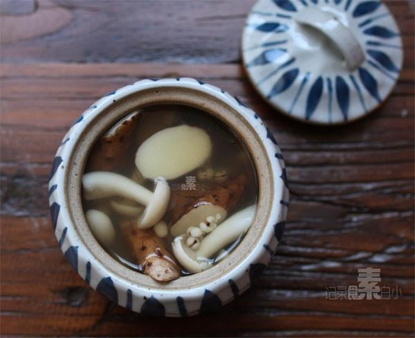

# 蘑菇汤 (Home-Style Fresh Mixed Mushroom Clear Soup)

## 📋 基本資訊 / Recipe Overview
- **料理名稱 (繁體)**：蘑菇湯
- **料理名称 (简体)**：蘑菇汤
- **English Title**：Home-Style Fresh Mixed Mushroom Clear Soup
- **素食流派 / Diet**：全素 / 纯素 Vegan (纯净素)
- **料理分類 / Category**：02-菌菇山珍类 / 全国家常 / 清润素汤
- **份量 / Servings**：3-4 人份
- **準備時間 / Prep Time**：10 分鐘
- **烹飪時間 / Cook Time**：12 分鐘
- **總計耗時 / Total Time**：22 分鐘
- **來源 / Source**：现代中华素菜 Top 100 · [02-菌菇山珍类.md](../02-菌菇山珍类.md) 第 91 道

## 📖 菜品特色 / Description
鲜蘑菇煮汤，家常。（多种鲜蘑菇家常清汤，简朴鲜美。）

---

## 🌿 食材與調味清單 / Ingredients & Seasonings
### 主料
- 新鲜平菇 100g（撕成小条）
- 鲜香菇 3 朵（约 60g，切厚片）
- 白玉菇 80g（去根切段）
- 蟹味菇 80g（去根切段）
- 嫩豆腐 100g（切小丁，增添滑嫩口感）

### 辅料与调味
- 植物油 1 汤匙（约 15ml）
- 鲜生姜 5g（切细丝）
- 沸水 / 清水 1000ml
- 食盐 1 茶匙（约 5g）
- 白胡椒粉 1/4 茶匙（约 1g）
- 纯芝麻香油 1/2 茶匙（约 2.5ml）
- 香芹末 / 鲜香菜碎 10g（出锅增香）

---

## 🍳 烹飪步驟 / Step-by-Step Cooking Steps
### 步骤 1：食材清洗与改刀
1. 平菇撕小条，鲜香菇切片，白玉菇和蟹味菇切去老根冲洗干净，沥干水分。
2. 嫩豆腐切成 1.5cm 见方的小丁备用。

### 步骤 2：热油煸炒出菌香
1. 汤锅烧热倒入 1 汤匙植物油，下入姜丝煸香。
2. 倒入所有混合鲜蘑菇，保持中大火翻炒 1.5-2 分钟，直至蘑菇变软、炒出浓郁的菌香味。

### 步骤 3：冲入沸水大火滚汤
1. 锅中一口气冲入 1000ml 沸水（高温热水可促使菌类多糖与油脂乳化，汤色清亮微白）。
2. 大火煮沸后撇去表面浮沫，下入嫩豆腐丁，转中小火慢滚煮 8 分钟，使多种菌菇的鲜味充分交融。

### 步骤 4：调味出锅
1. 加入 1 茶匙食盐和 1/4 茶匙白胡椒粉搅匀。
2. 关火，淋入 1/2 茶匙香油，撒上香芹末或香菜碎，盛入汤碗即可。

---

## 💡 大厨秘诀 / Chef's Tips
1. **先炒后煮激发香气**：混合鲜蘑菇先用少许热油煸炒出水分与菌香，再加热水滚煮，汤味比直接冷水下锅鲜浓数倍。
2. **多菌复合鲜味加倍**：平菇的清甜、香菇的浓香、白玉菇与蟹味菇的脆嫩相互融合，无需添加任何味精即可鲜美醇厚。
3. **白胡椒与香芹提味**：少许白胡椒粉能驱寒暖胃提鲜，出锅撒香芹碎能为菌菇清汤带来一抹灵动的清香。

---
*食谱归档时间：2026-08-21 · 收录于 20260818-vegetarianism 本地菜谱库 (1Top 精选)*
