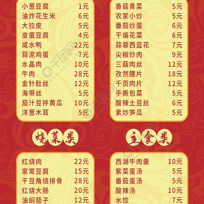

# 酸辣木耳 (Hot and Sour Black Fungus)

## 📋 基本資訊 / Recipe Overview
- **料理名稱 (繁體)**：酸辣木耳
- **料理名称 (简体)**：酸辣木耳
- **English Title**：Hot and Sour Black Fungus
- **素食流派 / Diet**：全素 / 纯素 Vegan (含大蒜、葱花；纯净素去蒜葱改用姜丝和纯野山椒)
- **料理分類 / Category**：02-菌菇山珍类 / 川湘风味 / 酸辣开胃
- **份量 / Servings**：2-3 人份
- **準備時間 / Prep Time**：10 分鐘
- **烹飪時間 / Cook Time**：4 分鐘
- **總計耗時 / Total Time**：14 分鐘
- **來源 / Source**：现代中华素菜 Top 100 · [02-菌菇山珍类.md](../02-菌菇山珍类.md) 第 14 道

## 📖 菜品特色 / Description
木耳酸辣拌或炒，开胃。

---

## 🌿 食材與調味清單 / Ingredients & Seasonings
### 主料
- 黑木耳（泡发好） 200g（撕成适口小朵）

### 调味料 / 配料
- 四川泡野山椒 4-5 个（切小碎段，含泡椒水 1 汤匙）
- 干红辣椒 3 根（剪段）
- 四川大红袍花椒 15 粒
- 大蒜 3 瓣（切片）
- 生姜 2 片（切丝）
- 葱段 1 根
- 四川保宁醋 / 优质老陈醋 1.5 汤匙（约 22.5ml）
- 优质生抽 1 汤匙（约 15ml）
- 白糖 1/2 汤匙（约 7.5g，平衡酸辣）
- 食盐 1/3 茶匙（约 2g）
- 红油辣椒油 1 汤匙（约 15ml）
- 花生油 1.5 汤匙（约 22.5ml）

---

## 🍳 烹飪步驟 / Step-by-Step Cooking Steps
### 步骤 1：木耳焯水与控干水分
1. 木耳入沸水锅中焯烫 1.5 分钟，捞出过凉开水彻底控干水分备用。

### 步骤 2：炝香干椒花椒与泡椒
1. 热锅倒油，冷油下花椒粒小火炸出麻香后捞去花椒，下入姜丝、蒜片、干辣椒段和切碎的泡椒翻炒出酸辣炝香。

### 步骤 3：大火急炒下木耳裹味
1. 倒入木耳大火快速翻炒 30 秒，淋入泡椒水、生抽、食盐和白糖快速兜炒均匀。

### 步骤 4：锅边烹醋淋红油出锅
1. 加入葱段，沿锅边高温处烹入陈醋激起酸香，淋入红油辣椒油颠翻 3 下，红亮酸辣，即可出锅装盘。

---

## 💡 大厨秘诀 / Chef's Tips
1. **泡椒是复合酸辣的核心**：用泡野山椒及其原汁代替单纯的醋辣，酸味醇厚带发酵香气，辣中生津，是川式酸辣的精髓。
2. **先花椒炝油再下辅料**：小火慢炸花椒将麻香融入底油，捞出花椒可避免咬到花椒粒影响口感，油香麻纯。
3. **最后淋醋与红油保色香**：老陈醋在高温锅边烹入能锁住酸香而不发涩，出锅前淋一勺红油使木耳乌黑发亮、油润诱人。

---
*食谱归档时间：2026-08-21 · 收录于 20260818-vegetarianism 本地菜谱库 (1Top 精选)*
