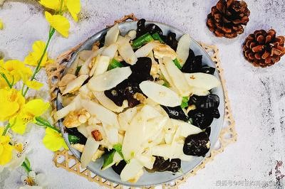

# 银耳炒山药 (Stir-Fried Tremella with Chinese Yam)

## 📋 基本資訊 / Recipe Overview
- **料理名稱 (繁體)**：銀耳炒山藥
- **料理名称 (简体)**：银耳炒山药
- **English Title**：Stir-Fried Tremella with Chinese Yam
- **素食流派 / Diet**：全素 / 纯素 Vegan (含葱蒜；纯净素去葱蒜用姜丝替代)
- **料理分類 / Category**：02-菌菇山珍类 / 养生雅炒 / 滑嫩清脆
- **份量 / Servings**：2-3 人份
- **準備時間 / Prep Time**：15 分鐘
- **烹飪時間 / Cook Time**：4 分鐘
- **總計耗時 / Total Time**：19 分鐘
- **來源 / Source**：现代中华素菜 Top 100 · [02-菌菇山珍类.md](../02-菌菇山珍类.md) 第 17 道

## 📖 菜品特色 / Description
少数热炒银耳，滑嫩爽脆。

---

## 🌿 食材與調味清單 / Ingredients & Seasonings
### 主料
- 泡发好的优质银耳 1 朵（泡发后约 150g，去硬蒂撕成适口小朵）
- 铁棍脆山药 1 根（约 200g，去皮切薄菱形片）
- 胡萝卜 1/4 根（切菱形薄片配色）
- 荷兰豆 / 青椒片 30g（配色）

### 调味料 / 配料
- 生姜 2 片（切丝）
- 大蒜 2 瓣（切片）
- 葱白 1 段
- 食盐 1/2 茶匙（约 2.5g）
- 白糖 1/3 茶匙（约 1.5g，提鲜）
- 素高汤 / 清水 2 汤匙
- 水淀粉 1.5 汤匙（生粉 1 茶匙 + 清水 1.5 汤匙，薄薄勾玻璃芡）
- 花生油 2 汤匙（约 30ml）

---

## 🍳 烹飪步驟 / Step-by-Step Cooking Steps
### 步骤 1：食材改刀与山药防氧化浸泡
1. 山药去皮切薄片浸入淡醋水中防黑；银耳泡软去黄蒂撕小朵备用。

### 步骤 2：分别焯水锁住脆滑口感
1. 沸水中加少许盐和油，先下山药片与胡萝卜焯水 40 秒捞出；再下银耳小朵焯水 30 秒迅速捞出，全部过凉水沥干。

### 步骤 3：爆香底料大火快炒
1. 热锅凉油，下蒜片、葱白和姜丝爆香。
2. 倒入控干的山药、银耳、胡萝卜及荷兰豆，转大火猛火翻炒 30 秒。

### 步骤 4：清淡调味勾薄芡出锅
1. 加入食盐、白糖及 2 汤匙素高汤。
2. 淋入水淀粉快速颠锅翻匀，让银耳自带的天然润滑与薄芡融为一体，装盘即成。

---

## 💡 大厨秘诀 / Chef's Tips
1. **热炒银耳控时要极短**：银耳热炒不同于炖汤，焯水只需 30 秒断生即可，过凉水后保持其爽脆滑弹的独特筋骨，切忌久炒。
2. **银耳自带胶质与薄芡融合**：银耳加热释放微量多糖，配合极轻薄的水淀粉，能让每一片山药都裹上滑润多汁的亮光，清爽不腻。
3. **双脆合璧清雅滋补**：山药清脆、银耳滑脆、胡萝卜与荷兰豆脆甜，色泽洁白翠红相映，极具养生美感。

---
*食谱归档时间：2026-08-21 · 收录于 20260818-vegetarianism 本地菜谱库 (1Top 精选)*
