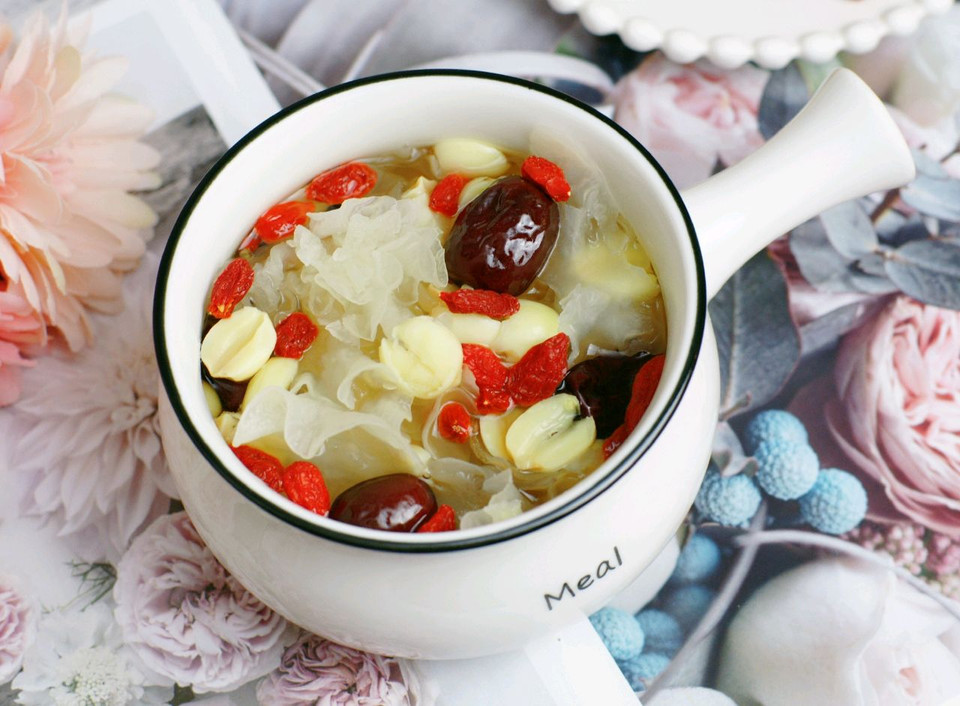

# 银耳莲子羹 (Tremella and Lotus Seed Sweet Soup)

## 📋 基本資訊 / Recipe Overview
- **料理名稱 (繁體)**：銀耳蓮子羹
- **料理名称 (简体)**：银耳莲子羹
- **English Title**：Tremella and Lotus Seed Sweet Soup (Chinese Sweet White Fungus Broth)
- **素食流派 / Diet**：全素 / 纯素 Vegan (纯素养生甜羹)
- **料理分類 / Category**：02-菌菇山珍类 / 养生甜品 / 浓稠胶润
- **份量 / Servings**：3-4 人份
- **準備時間 / Prep Time**：2 小時（泡发时间）+ 5 分鐘
- **烹飪時間 / Cook Time**：40 分鐘
- **總計耗時 / Total Time**：45 分鐘（不含泡发）
- **來源 / Source**：现代中华素菜 Top 100 · [02-菌菇山珍类.md](../02-菌菇山珍类.md) 第 15 道

## 📖 菜品特色 / Description
银耳为主的甜羹，润燥；偏羹汤也可入 05，此处算菌菇甜品。

---

## 🌿 食材與調味清單 / Ingredients & Seasonings
### 主料
- 优质干银耳 / 丑耳 1 朵（干重约 20g，泡发后胶质浓郁）
- 建宁干莲子 30g（无心或已去苦芯）
- 优质红枣 6-8 颗（洗净去核切半）
- 宁夏枸杞 15g

### 调味料 / 配料
- 黄老冰糖 / 单晶冰糖 40-50g（依个人甜度调整）
- 纯净水 1300ml-1500ml

---

## 🍳 烹飪步驟 / Step-by-Step Cooking Steps
### 步骤 1：银耳深度泡发与极致剪碎
1. 银耳用冷水浸泡 2 小时至完全舒展，剪掉底部黄色硬蒂，用剪刀将银耳剪成指甲盖大小的极小碎朵；莲子温水浸泡 30 分钟。

### 步骤 2：足水入锅大火狂煮与快速搅拌
1. 砂锅中一次性加入 1400ml 纯净水，放入剪碎的银耳和莲子。
2. 大火烧沸后用筷子或蛋抽快速顺时针搅拌 30 秒，加速银耳细胞破壁与胶质溢出。

### 步骤 3：中小火慢炖与出胶
1. 转中小火加盖慢炖 25-30 分钟，保持汤水微沸，中途每隔 10 分钟顺时针搅拌一次防糊底，直到汤汁变粘稠拉丝。

### 步骤 4：加红枣冰糖与枸杞收尾
1. 放入去核红枣和黄冰糖，继续小火慢炖 10 分钟至冰糖融化。
2. 出锅前 2 分钟撒入枸杞搅匀，关火即可盛碗享用。

---

## 💡 大厨秘诀 / Chef's Tips
1. **银耳剪得越碎出胶越快越浓**：银耳植物多糖胶质储存在细胞壁内，剪碎能极大增加与热水的接触面积，40 分钟即可熬出满满天然植物胶原拉丝感。
2. **冰糖后放不影响胶质释放**：过早放糖会使液体渗透压升高，导致银耳不易软烂出胶，务必等银耳煮出稠胶后再放冰糖。
3. **水要一次性加足忌中途添冷水**：中途加冷水会使胶质凝结稀释，煮时若水量不足需补充务必加沸水。
4. **枸杞最后两分钟下防酸**：枸杞久煮易破皮变酸且汤色浑浊，临出锅前下入焖 2 分钟即可保持红艳甜润。

---
*食谱归档时间：2026-08-21 · 收录于 20260818-vegetarianism 本地菜谱库 (1Top 精选)*
