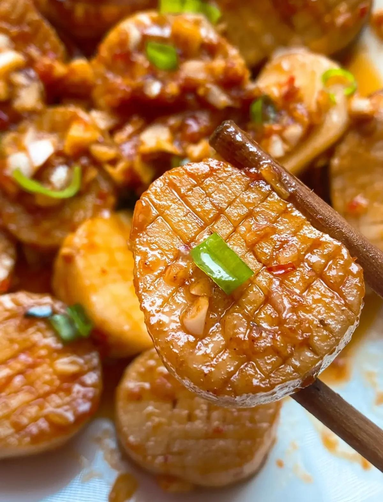

# 香煎杏鮑菇 (Pan-Seared King Oyster Mushroom Steaks)

## 📋 基本資訊 / Recipe Overview
- **料理名稱 (繁體)**：香煎杏鮑菇
- **料理名称 (简体)**：香煎杏鲍菇
- **English Title**：Pan-Seared King Oyster Mushroom Steaks
- **素食流派 / Diet**：全素 / 纯素 Vegan (纯净素 / 无五辛)
- **料理分類 / Category**：02-菌菇山珍类 / 煎炙本味 / 极简料理
- **份量 / Servings**：2-3 人份
- **準備時間 / Prep Time**：8 分鐘
- **烹飪時間 / Cook Time**：7 分鐘
- **總計耗時 / Total Time**：15 分鐘
- **來源 / Source**：现代中华素菜 Top 100 · [02-菌菇山珍类.md](../02-菌菇山珍类.md) 第 23 道

## 📖 菜品特色 / Description
厚片花刀煎至金边，本味鲜美。

---

## 🌿 食材與調味清單 / Ingredients & Seasonings
### 主料
- 直挺粗壮杏鲍菇 3 根（约 350g）

### 调味料
- 优质植物油 / 橄榄油 1.5 汤匙（22ml）
- 优质纯酿生抽 1 汤匙（15ml）
- 素蚝油 1/2 汤匙（7.5g）
- 海盐 / 喜马拉雅粉盐 1/4 茶匙（1.5g）
- 现磨黑胡椒碎 1/3 茶匙（约 1g）
- 熟白芝麻 1 茶匙（3g）
- 孜然粉 / 辣椒粉（可选，增添烧烤风味）各 1/4 茶匙

---

## 🍳 烹飪步驟 / Step-by-Step Cooking Steps
### 步骤 1：厚片改刀与双面花刀
1. 杏鲍菇用湿布擦拭干净，切除两端不规则部分。
2. 将中段切成约 1.5 - 2cm 厚的圆柱形厚片（如同素牛排或素干贝厚度）。
3. **双面浅花刀**：在厚片的两面分别用刀尖轻划深度约 2-3mm 的网状十字花刀。划花刀既能打破表层坚韧纤维，又利于热力瞬间穿透与酱汁吸收。

### 步骤 2：中小火慢煎锁汁出金边
1. 平底铸铁锅或不粘锅烧热，倒入植物油晃匀。
2. 将杏鲍菇厚片整齐平铺入锅中，保持中小火慢煎。
3. 煎约 2.5 - 3 分钟，期间不要频繁翻动，直至底部煎出金黄色的硬边，并从边缘渗出微量鲜甜汁水。
4. 用筷子将厚片逐一翻面，继续慢煎另 2 分钟，至两面皆呈现均匀诱人的金黄色与金边。

### 步骤 3：刷汁微调与入味
1. 取小碗将生抽 1 汤匙与素蚝油 1/2 汤匙调匀。
2. 用硅胶刷将调味汁薄薄地刷在杏鲍菇厚片两面的花刀缝隙上。
3. 继续在锅中小火翻转煎制 30 秒，使酱油焦香（生抽遇热产生的焦糖化香气）与菇香完美融合。

### 步骤 4：撒料装盘
1. 关火前均匀撒上海盐碎、现磨黑胡椒碎与熟白芝麻。
2. 如喜好烧烤风味可撒少许孜然粉，整齐夹出排盘，趁热食用享受丰腴多汁的本味体验。

---

## 💡 大厨秘诀 / Chef's Tips
1. **切厚片不低于 1.5cm**：太薄容易煎干变柴，1.5-2cm 的厚度在煎出香脆金边后内部依然饱含水润鲜甜的菌汁。
2. **耐火慢煎不频翻**：保持中小火静置慢煎，让热量慢慢逼出多余水分并结出金黄焦壳，锁住内部汁水。
3. **极简调味凸显本味**：杏鲍菇富含天然谷氨酸，只需生抽、黑胡椒与海盐激发，无需繁杂香料即鲜甜无比。

---
*食谱归档时间：2026-08-21 · 收录于 20260818-vegetarianism 本地菜谱库 (1Top 精选)*
