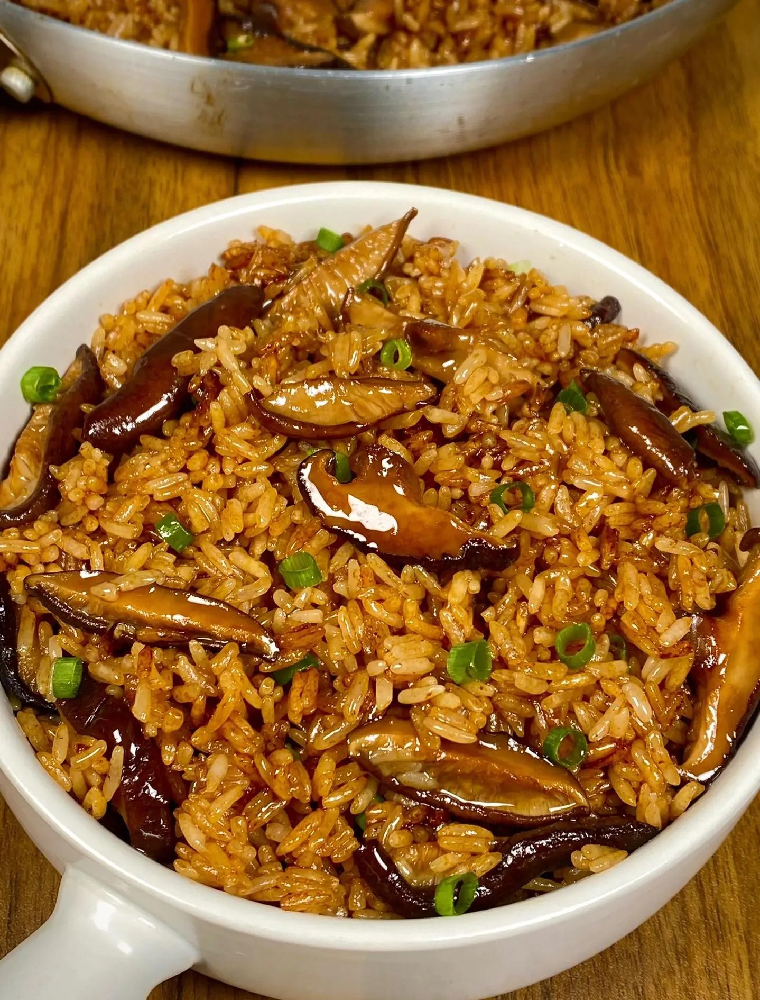

# 香菇油饭 (Taiwanese & Minnan Shiitake Steamed Glutinous Rice (Youfan))

## 📋 基本資訊 / Recipe Overview
- **料理名稱 (繁體)**：香菇油飯
- **料理名称 (简体)**：香菇油饭
- **English Title**：Taiwanese & Minnan Shiitake Steamed Glutinous Rice (Youfan)
- **素食流派 / Diet**：全素 / 纯素 Vegan (含红葱酥五辛素；纯素可用生姜纯麻油香菇煸透替代)
- **料理分類 / Category**：02-菌菇山珍类 / 闽台传统主食 / 经典古早味
- **份量 / Servings**：3-4 人份
- **準備時間 / Prep Time**：3 小時 (含糯米与干香菇充分浸泡)
- **烹飪時間 / Cook Time**：30 分鐘
- **總計耗時 / Total Time**：3.5 小時
- **來源 / Source**：现代中华素菜 Top 100 · [02-菌菇山珍类.md](../02-菌菇山珍类.md) 第 95 道

## 📖 菜品特色 / Description
香菇油拌饭或油饭，闽台。（闽南台湾传统糯米油饭，麻油香菇煸透蒸焖。）

---

## 🌿 食材與調味清單 / Ingredients & Seasonings
### 主料
- 优质长糯米 300g（浸泡后蒸熟）
- 优质干香菇 8 朵（约 30g，泡发后切细丝）
- 鲜生姜 15g（切细丝，纯素核心香气）
- 红葱头酥 2 汤匙（约 20g，纯素者可用炸金黄的香菇脚碎与姜末替代）
- 炸豆皮丝 / 素肉丝 40g（泡软切丝）

### 调味料与酱汁
- 纯黑芝麻油 2 汤匙（约 30ml）
- 优质生抽 / 酱油 2 汤匙（约 30ml）
- 素蚝油 1 汤匙（约 15ml）
- 冰糖碎 1/2 茶匙（约 3g）
- 白胡椒粉 1/2 茶匙（约 2g，古早风味灵魂）
- 五香粉 1/4 茶匙（约 1g）
- 过滤沉淀的香菇水 120ml

---

## 🍳 烹飪步驟 / Step-by-Step Cooking Steps
### 步骤 1：糯米浸泡与隔水蒸熟
1. 长糯米淘洗干净，冷水浸泡 2-3 小时，沥干水分。
2. 蒸锅铺好蒸布，将浸泡好的糯米均匀铺在蒸格上，用筷子戳若干个透气小孔。
3. 大火蒸 25 分钟至米粒熟透、晶莹Q弹，关火保持温热备用。

### 步骤 2：黑麻油慢煸香菇丝与姜丝
1. 炒锅倒入 2 汤匙纯黑芝麻油，冷锅下入生姜丝，小火慢煸 2-3 分钟至姜丝微卷脱水、麻油香气扑鼻。
2. 下入切好的干香菇丝和豆皮丝，继续小火慢煸 3-4 分钟，直至香菇丝边缘微金黄焦香。

### 步骤 3：调味炒汁
1. 加入生抽 2 汤匙、素蚝油 1 汤匙、冰糖 1/2 茶匙、白胡椒粉 1/2 茶匙和五香粉 1/4 茶匙翻炒出酱香味。
2. 倒入 120ml 香菇水，大火煮沸后转小火熬煮 2 分钟成浓郁拌饭汁。

### 步骤 4：下熟糯米拌匀与回焖
1. 将蒸好的热糯米饭倒入炒料锅中，加入红葱头酥（或素炸香菇酥）。
2. 关火或转微火，用饭勺切拌快速翻拌，让每一粒糯米饭均匀吸收红亮的黑麻油酱汁与香菇丝。
3. 盖上锅盖用余温微焖 3 分钟，使米粒完全吸透酱汁油亮喷香，即可盛碗享用。

---

## 💡 大厨秘诀 / Chef's Tips
1. **糯米蒸熟而非电饭煲煮**：做油饭最忌米饭烂黏。长糯米先泡水后上锅隔水干蒸，米粒粒粒分明、筋道Q弹。
2. **黑麻油小火煸透香菇与姜**：黑芝麻油不耐高温，需小火慢煸姜丝与香菇丝，逼出沉稳醇厚的古早焦香。
3. **白胡椒与香菇水是灵魂**：白胡椒粉独特的微辛能去油解腻，浓郁香菇水熬制的酱汁让整锅糯米饭油润鲜甜而不滞口。

---
*食谱归档时间：2026-08-21 · 收录于 20260818-vegetarianism 本地菜谱库 (1Top 精选)*
