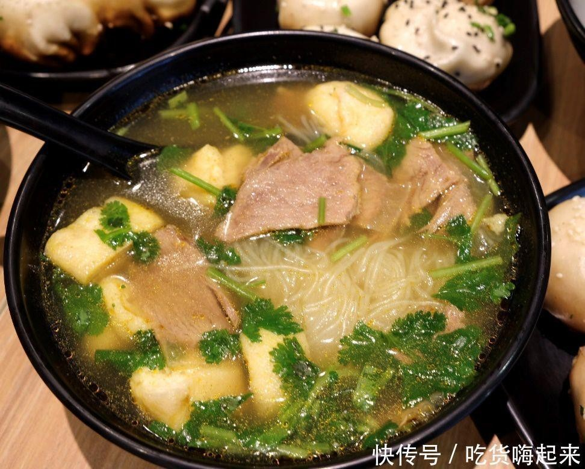

# 香菇炖白菜 (Northern Braised Napa Cabbage with Shiitake Mushrooms)

## 📋 基本資訊 / Recipe Overview
- **料理名稱 (繁體)**：香菇燉白菜
- **料理名称 (简体)**：香菇炖白菜
- **English Title**：Northern Braised Napa Cabbage with Shiitake Mushrooms
- **素食流派 / Diet**：全素 / 纯素 Vegan (含葱蒜；可去葱蒜为纯净素)
- **料理分類 / Category**：02-菌菇山珍类 / 北方炖菜 / 鲜甜多汁
- **份量 / Servings**：2-3 人份
- **準備時間 / Prep Time**：10 分鐘
- **烹飪時間 / Cook Time**：15 分鐘
- **總計耗時 / Total Time**：25 分鐘
- **來源 / Source**：现代中华素菜 Top 100 · [02-菌菇山珍类.md](../02-菌菇山珍类.md) 第 7 道

## 📖 菜品特色 / Description
北方家常，香菇汤炖白菜，鲜甜。

---

## 🌿 食材與調味清單 / Ingredients & Seasonings
### 主料
- 北方大白菜 500g（手撕成大片，帮与叶分开放置）
- 优质干香菇 6-8 朵（温水泡发后切厚丝，保留过滤香菇水）或鲜香菇 150g
- 红薯粉丝 50g（温水提前泡软剪短）

### 调味料 / 配料
- 大葱段 1 汤匙
- 生姜 3 片
- 大蒜 2 瓣（切片）
- 生抽 2 汤匙（约 30ml）
- 素蚝油 1 汤匙（约 15ml）
- 食盐 1 茶匙（约 5g）
- 白胡椒粉 1/3 茶匙
- 芝麻香油 1 茶匙（约 5ml）
- 花生油 2 汤匙（约 30ml）

---

## 🍳 烹飪步驟 / Step-by-Step Cooking Steps
### 步骤 1：食材备料与手撕白菜
1. 大白菜洗净，菜帮用刀背轻拍松散后斜刀片成薄片，菜叶手撕成适口大块；粉丝温水泡软剪短备用。

### 步骤 2：煸炒香菇激发深层菌香
1. 锅中倒入花生油烧热，下姜片、大葱段和蒜片爆香。
2. 放入切好的香菇丝，中火煸炒 2 分钟至水汽蒸发、菇香四溢。

### 步骤 3：先帮后叶焖出白菜清甜
1. 下入白菜帮大火翻炒 1 分钟至半透明变软。
2. 下入白菜叶和少许盐翻炒至叶子塌软，析出天然清甜菜汁。

### 步骤 4：加入原汤与粉丝慢炖
1. 倒入过滤后的香菇原汤与生抽、素蚝油、白胡椒粉，大火煮沸。
2. 铺上泡软的红薯粉丝，盖上锅盖中小火慢炖 6-8 分钟至白菜软烂、粉丝吸透汤汁，淋入香油即可出锅。

---

## 💡 大厨秘诀 / Chef's Tips
1. **手撕与拍帮更易入味**：大白菜帮部纤维厚实，用刀背轻拍松散后再斜刀片开，相比直刀切更能吸收香菇的鲜甜汤汁。
2. **先煸香菇再借白菜原汁炖**：香菇先用油煸透可释放出脂溶性香味物质；白菜加盐煸炒析出天然甜汁，与香菇水融为一体，无需添加味精即鲜美无比。
3. **粉丝后下吸饱鲜汁**：红薯粉丝不宜过早入锅以免炖烂糊汤，待白菜炖至八成熟时埋入汤汁中慢煨 3 分钟，晶莹爽滑、吸足全锅精华。

---
*食谱归档时间：2026-08-21 · 收录于 20260818-vegetarianism 本地菜谱库 (1Top 精选)*
