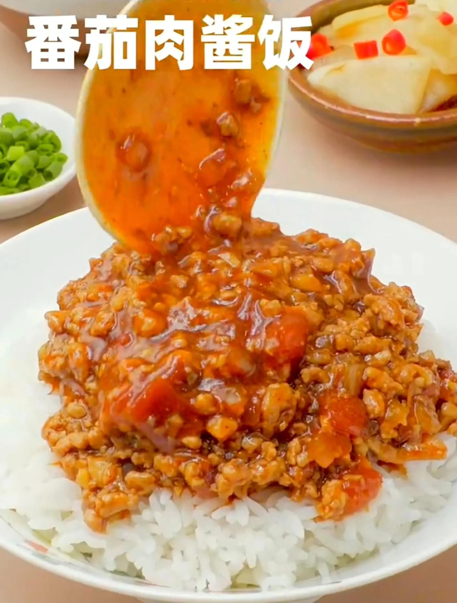

# 香菇素肉酱 (Savory Shiitake & Textured Soy Vegetarian Meat Sauce)

## 📋 基本資訊 / Recipe Overview
- **料理名稱 (繁體)**：香菇素肉醬
- **料理名称 (简体)**：香菇素肉酱
- **English Title**：Savory Shiitake & Textured Soy Vegetarian Meat Sauce
- **素食流派 / Diet**：全素 / 纯素 Vegan (含葱姜蒜或纯素豆酱)
- **料理分類 / Category**：02-菌菇山珍类 / 秘制酱料 / 万能佐餐拌酱
- **份量 / Servings**：常备酱料 (约 500g 罐装)
- **準備時間 / Prep Time**：20 分鐘 (含干香菇泡发与切小丁)
- **烹飪時間 / Cook Time**：25 分鐘
- **總計耗時 / Total Time**：45 分鐘
- **來源 / Source**：现代中华素菜 Top 100 · [02-菌菇山珍类.md](../02-菌菇山珍类.md) 第 93 道

## 📖 菜品特色 / Description
香菇丁炒成下饭酱。（干香菇丁加豆瓣甜面酱慢熬成浓郁万能拌饭酱。）

---

## 🌿 食材與調味清單 / Ingredients & Seasonings
### 主料
- 优质干香菇 60g（冷水泡发后约 220g，切 0.5cm 小丁）
- 脱水大豆蛋白碎（或五香老豆腐干）100g（泡发后切小碎丁）
- 熟花生碎 30g（去皮压碎）
- 熟白芝麻 15g

### 复合酱料
- 优质纯植物油 / 菜籽油 4 汤匙（约 60ml，熬酱需充足油脂以封存香气与防腐）
- 郫县豆瓣酱（剁细）1.5 汤匙（约 25g）
- 传统甜面酱 2 汤匙（约 35g）
- 传统黄豆酱 2 汤匙（约 35g）
- 生抽 1.5 汤匙（约 22ml）
- 香菇素蚝油 1 汤匙（约 15ml）
- 老冰糖碎 1.5 汤匙（约 20g）
- 澄清干香菇原汤 150ml
- 鲜生姜末 15g（五辛素可选放大蒜末 15g）

---

## 🍳 烹飪步驟 / Step-by-Step Cooking Steps
### 步骤 1：干香菇泡发与食材切丁
1. 干香菇洗净灰尘，用温水浸泡 2 小时至完全软透，捞出挤去多余水分（保留浸泡香菇的原汤并沉淀过滤备用）。
2. 将泡发好的香菇切成 0.5cm 均匀的小方丁。
3. 大豆蛋白碎泡软挤干（或豆腐干切同等大小细丁）。

### 步骤 2：冷油煸干香菇丁与素肉丁
1. 炒锅倒入 4 汤匙植物油，冷油下入姜末小火炒出香味。
2. 下入香菇丁和大豆蛋白丁，保持中小火耐心煸炒 6-8 分钟，直至水分大幅蒸发，香菇丁微缩呈金黄色、菌香扑鼻。

### 步骤 3：炒制三酱出红油浓香
1. 将煸香的香菇丁推至锅边，锅底余油中下入剁细的豆瓣酱、甜面酱和黄豆酱。
2. 小火慢炒 2-3 分钟，炒出红油和浓郁的复合酱香味，再与香菇丁充分翻炒均匀。

### 步骤 4：慢火熬煮与收汁封油
1. 倒入 150ml 澄清的香菇原汤，加入生抽、素蚝油和冰糖碎。
2. 大火煮沸后转小火，持续慢熬 10-12 分钟，期间不断用铲子画圈翻底以防糊锅，直至酱汁水分收干、表面泛起一层红亮清澈的香油。
3. 撒入熟花生碎和熟白芝麻，翻匀关火放凉，装入密封玻璃罐冷藏保存。

---

## 💡 大厨秘诀 / Chef's Tips
1. **干香菇优于鲜香菇**：熬制素肉酱必须选用干香菇，干香菇在脱水重组过程中生成的香菇精（Lenthionine）香气百倍于鲜菇，且保留的香菇水是天然鲜味高汤。
2. **小火慢煸去水汽**：香菇丁与素肉丁必须耐心地煸干水分，后期吸收酱汁才更筋道有嚼劲，且低含水量更利于酱料长期冷藏保存。
3. **复合酱汁与小火熬透**：豆瓣酱提色带辣、甜面酱醇厚微甜、黄豆酱咸鲜酱香，三酱合一与冰糖中和，熬至水尽油出方显醇厚滋味。

---
*食谱归档时间：2026-08-21 · 收录于 20260818-vegetarianism 本地菜谱库 (1Top 精选)*
