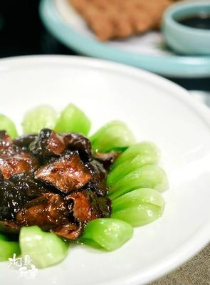

# 香菇菜心 (Braised Black Mushrooms with Bok Choy Hearts / Shanghai Style)

## 📋 基本資訊 / Recipe Overview
- **料理名稱 (繁體)**：香菇菜心
- **料理名称 (简体)**：香菇菜心
- **English Title**：Braised Black Mushrooms with Bok Choy Hearts (Shanghai Style)
- **素食流派 / Diet**：全素 / 纯素 Vegan (纯素无五辛，本帮素筵正统；亦可依喜好加蒜)
- **料理分類 / Category**：02-菌菇山珍类 / 沪菜精选 / 浓油赤酱与清鲜交融
- **份量 / Servings**：2-3 人份
- **準備時間 / Prep Time**：15 分鐘（若用干冬菇需提前泡发 2 小时）
- **烹飪時間 / Cook Time**：12 分鐘
- **總計耗時 / Total Time**：27 分鐘
- **來源 / Source**：现代中华素菜 Top 100 · [02-菌菇山珍类.md](../02-菌菇山珍类.md) 第 2 道

## 📖 菜品特色 / Description
上海本帮。冬菇配油菜心，比香菇油菜更讲究菜心。

---

## 🌿 食材與調味清單 / Ingredients & Seasonings
### 主料
- 优质干冬菇 / 优质鲜香菇 10-12 朵（约 150g，若为干香菇需温水加少许糖泡发）
- 精选油菜菜心 / 广东菜心 300g（修整成 8-10cm 长整齐菜胆）

### 调味料 / 配料
- 生姜 2 片（切细丝）
- 素高汤 / 过滤冬菇原汤 100ml
- 优质生抽 1.5 汤匙（约 22.5ml）
- 上海老抽 1/2 汤匙（约 7.5ml，上红亮酱色）
- 素蚝油 1 汤匙（约 15ml）
- 黄冰糖粉 / 白糖 1 茶匙（约 5g，本帮咸甜回甘灵魂）
- 食盐 1/3 茶匙（约 2g）
- 水淀粉 2 汤匙（生粉 1 茶匙 + 清水 2 汤匙）
- 熟植物油 1.5 汤匙（约 22.5ml）
- 焯水用调料：食盐 1 茶匙、食用植物油 1 茶匙

---

## 🍳 烹飪步驟 / Step-by-Step Cooking Steps
### 步骤 1：菜心精修与冬菇花刀
1. 菜心剥去外层老叶，保留脆嫩菜心，根部削成光滑橄榄形并划十字轻口；冬菇去蒂，表面刻精美十字花刀，保留沉淀滤清的冬菇水备用。

### 步骤 2：菜心高汤汆烫入底味
1. 锅中烧开足量水，加入食盐 1 茶匙与食用油 1 茶匙，放入菜心汆烫 45 秒至断生。
2. 捞出过凉开水沥干，头朝外根朝里整齐码入白瓷圆盘中成环形。

### 步骤 3：本帮煨法煨透冬菇
1. 锅热倒入植物油，下入姜丝煸炒出香味。
2. 放入冬菇翻炒片刻，倒入过滤好的冬菇原汤、生抽、老抽、素蚝油与冰糖粉。
3. 大火煮沸后转小火加盖焖煨 6-8 分钟，直至冬菇充分吸收汤汁浓郁入味、菇体厚润软糯。

### 步骤 4：浓汁淋油盛盘
1. 揭盖转大火收汁，淋入水淀粉推匀勾成明亮的玻璃薄芡。
2. 淋入少许熟植物油推亮芡汁，将冬菇整齐堆叠在盘中菜心中央，余汁均匀浇淋全盘即可。

---

## 💡 大厨秘诀 / Chef's Tips
1. **本帮讲究“冬菇煨透”**：本帮名菜精髓在于“煨”，冬菇不可直接急炒，必须用小火慢煨让酱香甜咸渗入菇肉深处，咬下汁水四溢。
2. **冬菇原汤提鲜不浪费**：干冬菇泡发的头道水经沉淀滤去泥沙，含有浓缩天然鸟苷酸，用作煨汤比清水更醇香数倍。
3. **菜心削橄榄形入味匀**：菜心根部粗老处削去硬皮呈橄榄状并轻划十字刀，既美观雅致又能让根部与嫩叶同步成熟。
4. **红亮油光靠冰糖与明油**：用冰糖取代白糖能使芡汁色泽红亮清透，起锅前推入少许熟油（明油），成菜光彩夺目如素筵上品。

---
*食谱归档时间：2026-08-21 · 收录于 20260818-vegetarianism 本地菜谱库 (1Top 精选)*
