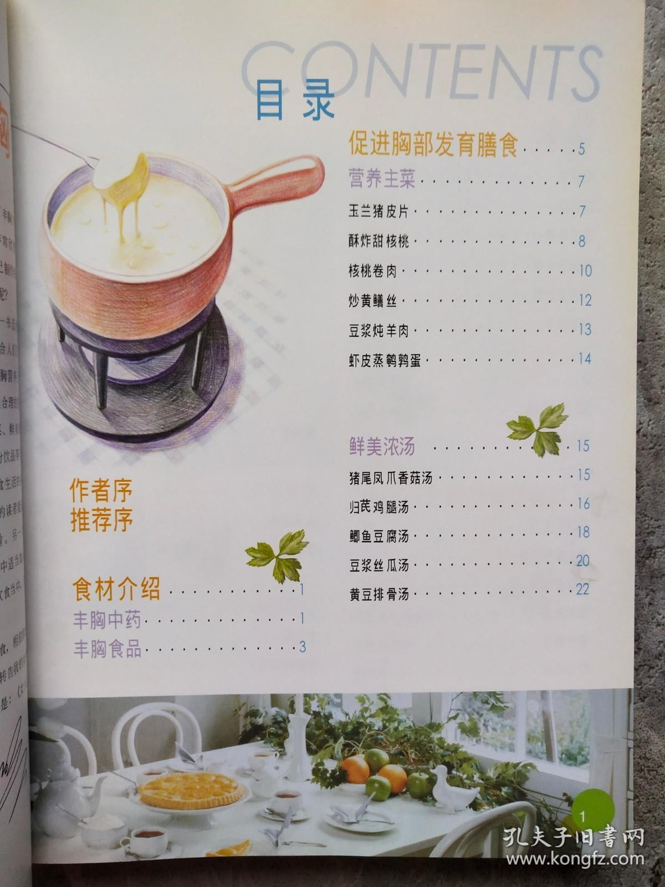

# 香菇豆腐汤 (Shiitake Mushroom and Tofu Soup)

## 📋 基本資訊 / Recipe Overview
- **料理名稱 (繁體)**：香菇豆腐湯
- **料理名称 (简体)**：香菇豆腐汤
- **English Title**：Shiitake Mushroom and Tofu Soup
- **素食流派 / Diet**：全素 / 纯素 Vegan (纯素无五辛；含生姜、香菜)
- **料理分類 / Category**：02-菌菇山珍类 / 养生汤羹 / 清雅鲜润
- **份量 / Servings**：2-3 人份
- **準備時間 / Prep Time**：8 分鐘
- **烹飪時間 / Cook Time**：12 分鐘
- **總計耗時 / Total Time**：20 分鐘
- **來源 / Source**：现代中华素菜 Top 100 · [02-菌菇山珍类.md](../02-菌菇山珍类.md) 第 8 道

## 📖 菜品特色 / Description
香菇与豆腐同煮，归汤则见粉面羹汤；热菜版香菇为主。

---

## 🌿 食材與調味清單 / Ingredients & Seasonings
### 主料
- 新鲜香菇 6-8 朵（约 150g，去蒂切厚片）
- 嫩豆腐 / 卤水南豆腐 1 块（约 300g，切 2cm 方块）
- 胡萝卜 1/3 根（约 30g，切细丝提色）

### 调味料 / 配料
- 生姜 3 片（切细丝）
- 香菜 1 根（洗净切碎）或细芹菜末 1 汤匙
- 沸水 / 清水 / 素高汤 700ml
- 优质生抽 1 汤匙（约 15ml）
- 食盐 1 茶匙（约 5g）
- 白胡椒粉 1/3 茶匙（暖胃提鲜）
- 芝麻香油 1 茶匙（约 5ml）
- 食用油 1 汤匙（约 15ml）

---

## 🍳 烹飪步驟 / Step-by-Step Cooking Steps
### 步骤 1：食材改刀与豆腐淡盐水浸泡
1. 豆腐切成 2cm 见方小块，放入加有少许盐的温水中浸泡 5 分钟沥干，去除豆腥并使蛋白质微凝不易碎。

### 步骤 2：煸炒香菇与姜丝激发鲜汤底
1. 汤锅中倒入 1 汤匙食用油烧热，下姜丝和香菇片中火煸炒 2 分钟，直到香菇变软出水散发出浓郁香味。

### 步骤 3：注入滚水煨煮豆腐
1. 倒入 700ml 沸水或素高汤，下入胡萝卜丝，加入生抽与食盐。
2. 大火煮沸后轻轻滑入豆腐块，转中小火加盖慢煮 6-8 分钟，让豆腐孔隙吸足菌鲜。

### 步骤 4：调味撒香菜出锅
1. 撒入白胡椒粉，淋入芝麻香油，关火撒上香菜碎，盛入大汤碗中趁热享用。

---

## 💡 大厨秘诀 / Chef's Tips
1. **香菇煸炒是清汤鲜美的关键**：香菇必须先用少许油和姜丝煸炒透，才能将菌菇的鲜味脂质溶出，直接冷水煮汤风味单薄。
2. **淡盐水浸泡豆腐防碎**：嫩豆腐切块后泡温盐水，可使表面蛋白质紧致不易在翻滚中碎散，同时去净卤水生涩味。
3. **白胡椒粉与香油点睛**：起锅前撒入少许白胡椒粉和纯小磨香油，能瞬间驱寒暖胃，烘托出菌菇与大豆的天然原香。

---
*食谱归档时间：2026-08-21 · 收录于 20260818-vegetarianism 本地菜谱库 (1Top 精选)*
