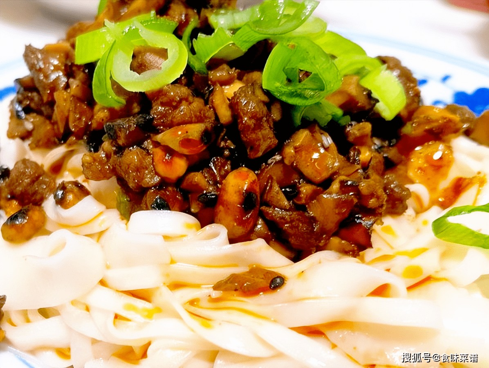

# 香菇酱拌面浇头 (Shiitake Mushroom Gravy Topping for Noodles)

## 📋 基本資訊 / Recipe Overview
- **料理名稱 (繁體)**：香菇醬拌麵澆頭
- **料理名称 (简体)**：香菇酱拌面浇头
- **English Title**：Shiitake Mushroom Gravy Topping for Noodles
- **素食流派 / Diet**：全素 / 纯素 Vegan (纯净素 / 五辛素可选)
- **料理分類 / Category**：02-菌菇山珍类 / 面点浇头 / 浓郁鲜美
- **份量 / Servings**：2-3 人份浇头
- **準備時間 / Prep Time**：15 分鐘
- **烹飪時間 / Cook Time**：10 分鐘
- **總計耗時 / Total Time**：25 分鐘
- **來源 / Source**：现代中华素菜 Top 100 · [02-菌菇山珍类.md](../02-菌菇山珍类.md) 第 94 道

## 📖 菜品特色 / Description
香菇酱作拌面。（香菇肉酱作拌面浇头，裹面香浓。）

---

## 🌿 食材與調味清單 / Ingredients & Seasonings
### 主料
- 自制或优质香菇素肉酱 4 汤匙（约 80g）
- 新鲜冬笋 / 脆马蹄 50g（切小碎丁，增加爽脆颗粒感）
- 鲜五香豆腐干 1 块（约 50g，切小丁）
- 鲜手擀面 / 阳春细面 250g（配面主料）

### 浇头调味与高汤
- 植物油 1 汤匙（约 15ml）
- 生抽 1 汤匙（约 15ml）
- 香菇素蚝油 1 汤匙（约 15ml）
- 素高汤 / 香菇水 150ml
- 水淀粉 2 汤匙（玉米淀粉 1 茶匙 + 清水 2 汤匙调匀）
- 白胡椒粉 1/4 茶匙（约 1g）

### 拌面配菜
- 黄瓜丝 50g、焯水绿豆芽 50g、熟花生碎 1 汤匙

---

## 🍳 烹飪步驟 / Step-by-Step Cooking Steps
### 步骤 1：配料备料与切丁
1. 冬笋（或去皮马蹄）和豆腐干分别切成 0.4cm 见方的小丁。
2. 黄瓜切细丝，绿豆芽开水焯烫 20 秒捞出沥干备用。

### 步骤 2：爆炒浇头配料
1. 炒锅烧热倒入 1 汤匙植物油，下入豆腐干丁和笋丁大火翻炒 1 分钟至表面微干香。
2. 倒入 4 汤匙香菇素肉酱，中火快速翻炒，让酱香完全包裹豆干与笋丁。

### 步骤 3：加汤煨煮与勾芡成浓浇头
1. 倒入 150ml 素高汤（或澄清香菇水），加入生抽、素蚝油和白胡椒粉。
2. 大火煮沸后转小火微煨 2-3 分钟使味道融合。
3. 沿锅边淋入水淀粉，转大火快速推匀收浓成红亮浓稠、挂勺成线的香浓浇头汁。

### 步骤 4：煮面与拌制
1. 另起大锅加宽水烧沸，下入鲜面条煮至九成熟（面芯微有白点时捞出最具嚼劲）。
2. 捞出面条沥干盛入大碗中，铺上黄瓜丝、绿豆芽。
3. 趁热将满满两勺滚烫浓郁的香菇酱浇头淋在面条中央，撒上熟花生碎，翻拌均匀即可享用。

---

## 💡 大厨秘诀 / Chef's Tips
1. **笋丁与豆干增添层次**：在浓稠香菇酱中融入脆笋丁与软韧豆干，使拌面浇头富有“脆、软、韧、滑”的丰富咀嚼感。
2. **汤汁稠度适中挂面**：浇头水淀粉勾芡要调至略带流动的浓稠度，过稀无法挂在面条上，过稠不易拌匀。
3. **面条九成熟不过水**：热拌面条建议煮至九成熟捞出不冲凉水，温热的面条能迅速吸收香菇酱浓汁，麦香与菌香融为一体。

---
*食谱归档时间：2026-08-21 · 收录于 20260818-vegetarianism 本地菜谱库 (1Top 精选)*
