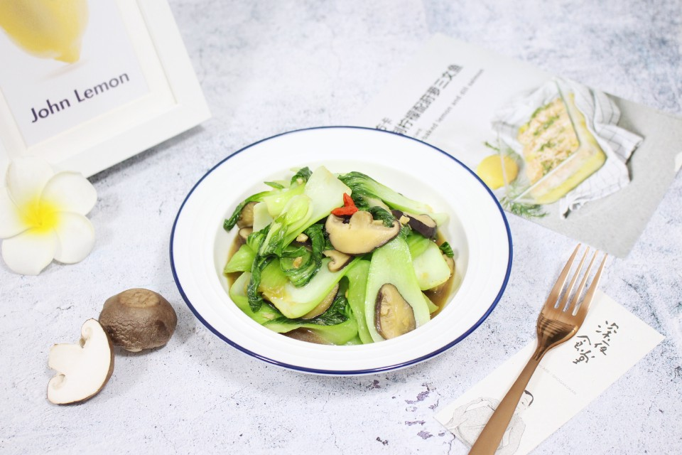

# 香菇青菜 (Stir-Fried Bok Choy with Shiitake Mushrooms)

## 📋 基本資訊 / Recipe Overview
- **料理名稱 (繁體)**：香菇青菜
- **料理名称 (简体)**：香菇青菜
- **English Title**：Stir-Fried Bok Choy with Shiitake Mushrooms
- **素食流派 / Diet**：全素 / 纯素 Vegan (含大蒜；纯净素去蒜用生姜末替代)
- **料理分類 / Category**：02-菌菇山珍类 / 家常快炒 / 清鲜爽脆
- **份量 / Servings**：2-3 人份
- **準備時間 / Prep Time**：8 分鐘
- **烹飪時間 / Cook Time**：5 分鐘
- **總計耗時 / Total Time**：13 分鐘
- **來源 / Source**：现代中华素菜 Top 100 · [02-菌菇山珍类.md](../02-菌菇山珍类.md) 第 3 道

## 📖 菜品特色 / Description
小白菜或上海青配鲜菇，家常高频。

---

## 🌿 食材與調味清單 / Ingredients & Seasonings
### 主料
- 小白菜 / 上海青 400g（掰开洗净泥沙，彻底沥干水分）
- 鲜香菇 5-6 朵（约 120g，洗净切 3mm 薄片）

### 调味料 / 配料
- 大蒜 3 瓣（切薄片）
- 优质生抽 1 汤匙（约 15ml）
- 食盐 1/2 茶匙（约 2.5g）
- 白糖 1/3 茶匙（约 1.5g，去青涩提清甜）
- 花生油 2 汤匙（约 30ml）
- 水淀粉 1 汤匙（生粉 1/2 茶匙 + 清水 1 汤匙，薄勾防出汤）

---

## 🍳 烹飪步驟 / Step-by-Step Cooking Steps
### 步骤 1：食材改刀与干爽沥水
1. 小白菜一片片掰开洗净，用沥水篮彻底沥干或甩干水分，将菜帮与菜叶切开；鲜香菇切成均匀薄片。

### 步骤 2：热油爆香先煸香菇
1. 炒锅烧热倒入花生油，下蒜片爆出香味。
2. 迅速倒入香菇薄片，中大火翻炒 1 分钟，让香菇散发出浓郁菇香且表面微黄。

### 步骤 3：旺火下青菜急火翻炒
1. 转最大火，先下青菜帮快速翻炒 20 秒至半透明。
2. 下入青菜叶，继续大火猛炒 30 秒至菜叶受热塌软变深绿。

### 步骤 4：沿锅边调味迅速出锅
1. 沿锅边烹入生抽，撒入食盐和白糖，淋入薄水淀粉颠翻 4-5 下锁住水分，立即出锅装盘。

---

## 💡 大厨秘诀 / Chef's Tips
1. **青菜干爽是防出汤核心**：青菜洗净后务必彻底甩干水分，水汽过多会导致锅温下降变成“水煮菜”，失去爽脆镬气。
2. **先帮后叶受热均匀**：青菜帮肉厚不易熟，先炒帮 20 秒再下嫩叶，确保帮脆叶嫩，口感与熟度完美一致。
3. **大火急炒 1 分钟出锅**：全程保持旺火翻炒，调味沿热锅边烹入激发焦香，快速起锅保留青菜天然翠绿与维生素。

---
*食谱归档时间：2026-08-21 · 收录于 20260818-vegetarianism 本地菜谱库 (1Top 精选)*
