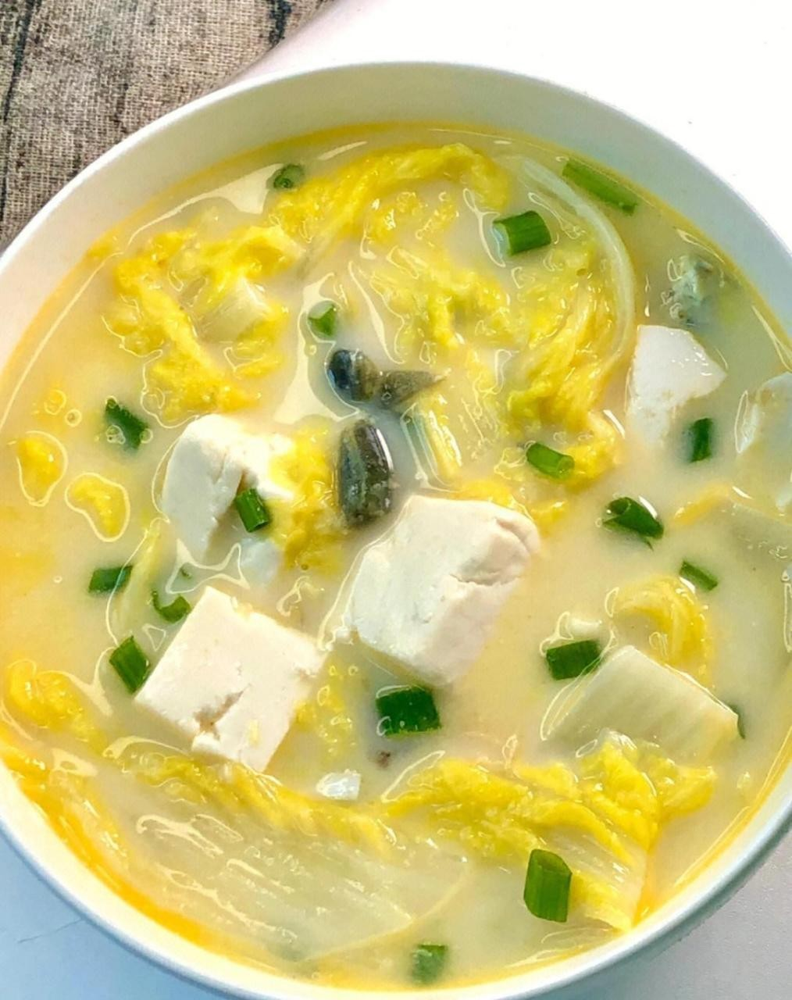

# 鲜上汤白菌扣 (Braised Fresh White Button Mushrooms in Superior Vegetarian Broth)

## 📋 基本資訊 / Recipe Overview
- **料理名稱 (繁體)**：鮮上湯白菌扣
- **料理名称 (简体)**：鲜上汤白菌扣
- **English Title**：Braised Fresh White Button Mushrooms in Superior Vegetarian Broth
- **素食流派 / Diet**：全素 / 纯素 Vegan (纯净素)
- **料理分類 / Category**：02-菌菇山珍类 / 粤式素筵扣菜 / 醇鲜多汁
- **份量 / Servings**：3-4 人份
- **準備時間 / Prep Time**：15 分鐘
- **烹飪時間 / Cook Time**：20 分鐘
- **總計耗時 / Total Time**：35 分鐘
- **來源 / Source**：现代中华素菜 Top 100 · [02-菌菇山珍类.md](../02-菌菇山珍类.md) 第 90 道

## 📖 菜品特色 / Description
罐头白菌或鲜口蘑，粤式扣素。（白菌/鲜口蘑粤式上汤煨扣，鲜美多汁。）

---

## 🌿 食材與調味清單 / Ingredients & Seasonings
### 主料
- 新鲜优质白菌（圆整白口蘑）400g
- 鲜嫩西兰花 / 菜心 100g（焯水围边）

### 煨制素上汤
- 清甜素上汤（黄豆芽、干香菇、胡萝卜熬煮）450ml
- 鲜生姜汁 1 茶匙（约 5ml）

### 调味与琉璃芡汁
- 植物油 1 汤匙（约 15ml）
- 香菇素蚝油 1.5 汤匙（约 22ml）
- 生抽 1 汤匙（约 15ml）
- 白砂糖 1/2 茶匙（约 2g）
- 食盐 1/3 茶匙（约 2g）
- 纯芝麻香油 1/2 茶匙（约 2.5ml）
- 水淀粉 2 汤匙（玉米淀粉 1 茶匙 + 清水 2 汤匙调匀）

---

## 🍳 烹飪步驟 / Step-by-Step Cooking Steps
### 步骤 1：白菌修整与花刀预处理
1. 白菌洗净沥干，切去菇柄多余部分使其平整，在菌盖顶部用小刀划上轻巧的十字花刀（便于深层吸收素上汤）。
2. 锅中烧沸水，下入白菌焯烫 1 分钟去生，捞出沥干。
3. 西兰花切小朵焯盐水至翠绿断生，捞出整齐码在盘边围成圆圈。

### 步骤 2：素上汤慢煨入味
1. 炒锅烧热倒入 1 汤匙油，加入姜汁与素蚝油、生抽小火煸香。
2. 倒入 450ml 素上汤与 1/2 茶匙白糖，放入焯好沥干的白菌。
3. 大火烧开后转小火，慢火煨煮 12-15 分钟，让白菌内部充分吸饱浓鲜的素上汤。

### 步骤 3：扣碗造型
1. 用漏勺将煨透的白菌捞出，菌盖朝下、整齐紧密地排入半圆形深底扣碗中。
2. 将扣碗倒扣在摆有西兰花的深盘正中央，轻轻取下扣碗，呈现饱满整齐的半球状。

### 步骤 4：调收原汁浇琉璃素芡
1. 将锅内剩余的煨菌原汤大火烧开，加入 1/3 茶匙食盐调味。
2. 淋入调匀的水淀粉，大火推匀勾成明亮透明的琉璃玻璃芡。
3. 滴入几滴香油，将芡汁缓缓淋在扣好的白菌顶上，使其油润透亮。

---

## 💡 大厨秘诀 / Chef's Tips
1. **十字花刀助吸汁**：新鲜白菌肉质肥厚紧实，顶部轻划十字花刀，能让素上汤与素蚝油的鲜味迅速渗透到菌肉核心。
2. **素上汤煨透入味**：粤式扣菜之妙全在上汤。煨足 15 分钟使白菌如海绵般饱吸菌鲜高汤，咬下瞬间汁水四溢。
3. **扣碗成型与琉璃芡**：先码入扣碗再倒扣于盘中，呈现酒楼名宴的大气造型；勾透明玻璃芡既保温又增添滑润口感。

---
*食谱归档时间：2026-08-21 · 收录于 20260818-vegetarianism 本地菜谱库 (1Top 精选)*
