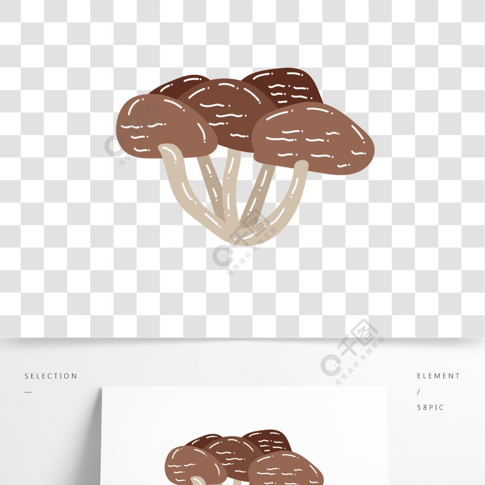

# 麻油猴頭菇 (Nourishing Lion's Mane Mushrooms Stewed in Black Sesame Oil and Ginger)

## 📋 基本資訊 / Recipe Overview
- **料理名稱 (繁體)**：麻油猴頭菇
- **料理名称 (简体)**：麻油猴头菇
- **English Title**：Nourishing Lion's Mane Mushrooms Stewed in Black Sesame Oil and Ginger
- **素食流派 / Diet**：全素 / 纯素 Vegan (纯净素 / 台闽客家滋补药膳)
- **料理分類 / Category**：02-菌菇山珍类 / 滋补药膳 / 客家风味
- **份量 / Servings**：2-3 人份
- **準備時間 / Prep Time**：30 分鐘
- **烹飪時間 / Cook Time**：20 分鐘
- **總計耗時 / Total Time**：50 分鐘
- **來源 / Source**：现代中华素菜 Top 100 · [02-菌菇山珍类.md](../02-菌菇山珍类.md) 第 30 道

## 📖 菜品特色 / Description
老姜片黑麻油慢煸猴头菇，台闽客家滋补药膳。

---

## 🌿 食材與調味清單 / Ingredients & Seasonings
### 主料
- 优质干猴头菇 4 朵（约 60g，去苦泡发后约 260g）
- 鲜杏鲍菇 1 根（约 150g，切滚刀块增加口感层次）

### 滋补配料
- 优质老姜 1 大块（约 35g，切薄片）
- 宁夏枸杞 15 粒
- 优质红枣 6 颗（去核切半）
- 纯素炸豆皮 / 皮丝 30g（温水泡软切段）

### 调味料
- 台湾纯黑麻油 2.5 汤匙（37ml）
- 植物油 1 汤匙（15ml）
- 台湾红标米酒 2 汤匙（30ml，纯素严格无醇者用素高汤替代）
- 食盐 1/2 茶匙（3g）
- 单晶冰糖 1 茶匙（5g）
- 白胡椒粉 1/4 茶匙（1g）
- 纯净水 / 素高汤 500ml

---

## 🍳 烹飪步驟 / Step-by-Step Cooking Steps
### 步骤 1：去苦泡发与撕块
1. 干猴头菇温水浸泡 20 分钟至软透，剪尽根部发黑硬蒂。
2. 在清水中反复揉搓、用力挤干水分，重复换水抓洗 6-7 遍至水清澈无黄色苦水，挤干撕成大块。
3. 杏鲍菇切滚刀块；皮丝泡软切段；红枣去核切半。

### 步骤 2：黑麻油冷油小火慢煸老姜
1. 砂锅中倒入 1 汤匙植物油和 1.5 汤匙黑麻油（混合油控温）。
2. 冷锅放入老姜薄片，开极小火慢慢煸炒 4-5 分钟。
3. 煸至姜片边缘微微卷曲、金黄起皱、释放深层温补姜香（客家麻油料理灵魂步骤）。

### 步骤 3：菌菇与豆皮入锅翻炒
1. 倒入挤干的猴头菇块、杏鲍菇块和泡软的皮丝，转中火翻炒 2-3 分钟。
2. 让菌菇和豆皮充分吸收锅内黑麻油与老姜的浓郁香气，表面泛出油亮光泽。

### 步骤 4：加汤药膳慢炖
1. 倒入米酒 2 汤匙、纯净水或素高汤 500ml，加入去核红枣。
2. 大火烧至沸腾，转中小火盖上砂锅盖慢炖 15 分钟，让菌菇与豆皮充分吸饱温润汤汁。

### 步骤 5：调味与起锅提香
1. 开盖加入食盐 1/2 茶匙、冰糖 1 茶匙与白胡椒粉 1/4 茶匙调匀。
2. 撒入枸杞，沿锅边淋入剩余 1 汤匙黑麻油，加盖小火再煮 1 分钟即可离火端上餐桌。

---

## 💡 大厨秘诀 / Chef's Tips
1. **冷油小火煸老姜**：黑麻油不耐高温，先混合植物油，冷油小火慢煸至姜片卷曲，香气浓郁温补且绝不燥苦。
2. **红枣去核防燥热**：药膳炖煮红枣必须去核，既能提供清甜汤感，又能避免上火，适合四季养胃。
3. **搭配杏鲍菇与皮丝**：猴头菇吸汤多汁，杏鲍菇脆嫩弹牙，豆皮吸香柔韧，三者交融口感极其丰满。

---
*食谱归档时间：2026-08-21 · 收录于 20260818-vegetarianism 本地菜谱库 (1Top 精选)*
