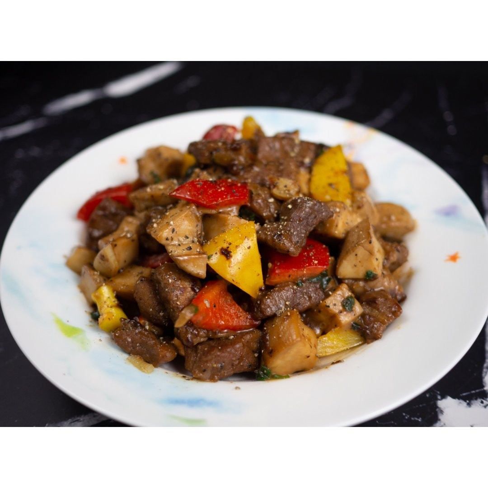

# 黑椒杏鮑菇 (Black Pepper King Oyster Mushrooms)

## 📋 基本資訊 / Recipe Overview
- **料理名稱 (繁體)**：黑椒杏鮑菇
- **料理名称 (简体)**：黑椒杏鲍菇
- **English Title**：Black Pepper King Oyster Mushrooms
- **素食流派 / Diet**：全素 / 纯素 Vegan (纯净素 / 无五辛)
- **料理分類 / Category**：02-菌菇山珍类 / 西式中做 / 仿肉风味
- **份量 / Servings**：2-3 人份
- **準備時間 / Prep Time**：10 分鐘
- **烹飪時間 / Cook Time**：8 分鐘
- **總計耗時 / Total Time**：18 分鐘
- **來源 / Source**：现代中华素菜 Top 100 · [02-菌菇山珍类.md](../02-菌菇山珍类.md) 第 22 道

## 📖 菜品特色 / Description
黑胡椒煎炒，西式中做，肉感十足。

---

## 🌿 食材與調味清單 / Ingredients & Seasonings
### 主料
- 粗壮杏鲍菇 2 根（约 300g）
- 青甜椒半个（约 50g，切菱形块）
- 红甜椒半个（约 50g，切菱形块）

### 配料
- 鲜生姜 2 片（切细末）
- 熟白芝麻 1 茶匙（3g）

### 黑椒碗芡汁
- 现磨粗粒黑胡椒碎 1.5 茶匙（约 4g，黑椒风味核心）
- 优质生抽 1.5 汤匙（22ml）
- 素蚝油 1 汤匙（15g）
- 老抽 1/2 茶匙（2.5ml，调上亮丽酱色）
- 白糖 1 茶匙（5g，中和辛辣提鲜）
- 纯素高汤 / 清水 3 汤匙（45ml）
- 玉米淀粉 1 茶匙（3g）

### 用油
- 植物油 1.5 汤匙（22ml）

---

## 🍳 烹飪步驟 / Step-by-Step Cooking Steps
### 步骤 1：食材改刀与切丁
1. 杏鲍菇洗净擦干，切成约 1.5cm 见方的均匀骰子块（切丁口感最似西式黑椒牛柳粒）。
2. 青、红甜椒洗净去籽去白筋，切成与杏鲍菇大小相仿的菱形块备用。
3. 姜切细末备用。

### 步骤 2：调制秘制黑椒碗芡
1. 取一小碗，加入现磨黑胡椒碎 1.5 茶匙、生抽 1.5 汤匙、素蚝油 1 汤匙、老抽 1/2 茶匙、白糖 1 茶匙、玉米淀粉 1 茶匙和清水 3 汤匙。
2. 用汤匙彻底搅拌均匀，使白糖融化、淀粉均匀化开备用。

### 步骤 3：干煸杏鲍丁起焦壳
1. 炒锅烧热，倒入 1 汤匙植物油晃匀润锅。
2. 放入杏鲍菇丁，平铺于锅底，中大火煸炒 3-4 分钟。
3. 煸至杏鲍菇表面水分收干、四周边缘呈现金黄焦香的微硬外壳（仿肉质感关键），盛出备用。

### 步骤 4：大火爆炒泼汁亮油
1. 锅中补入半汤匙植物油，下姜末爆香，随后倒入青红甜椒块大火翻炒 30 秒至断生返亮。
2. 倒入煸好的杏鲍菇丁，转大火翻炒均匀。
3. 再次搅匀黑椒碗芡，沿锅边一圈淋入锅中，快速大火颠锅翻炒 15-20 秒。
4. 待黑椒芡汁迅速浓稠、红亮透亮地紧紧包裹在每一颗杏鲍菇丁表面，撒上熟白芝麻，立即关火出锅。

---

## 💡 大厨秘诀 / Chef's Tips
1. **选用现磨粗粒黑胡椒**：切勿使用细腻的黑胡椒粉，现磨粗颗粒经高温热油激发后辛香醇正、清脆留香且无苦味。
2. **切骰子丁煸出焦壳**：杏鲍菇切 1.5cm 见方小丁，先经高温热油煸炒出微焦外皮，内部依然鲜嫩爆汁，嚼劲极似黑椒牛肉粒。
3. **预调碗芡大火速裹**：黑胡椒遇到高温易快速释放香气，提前调好碗芡，大火 20 秒迅速裹匀出锅，锁住锅气与黑椒浓郁辛香。

---
*食谱归档时间：2026-08-21 · 收录于 20260818-vegetarianism 本地菜谱库 (1Top 精选)*
