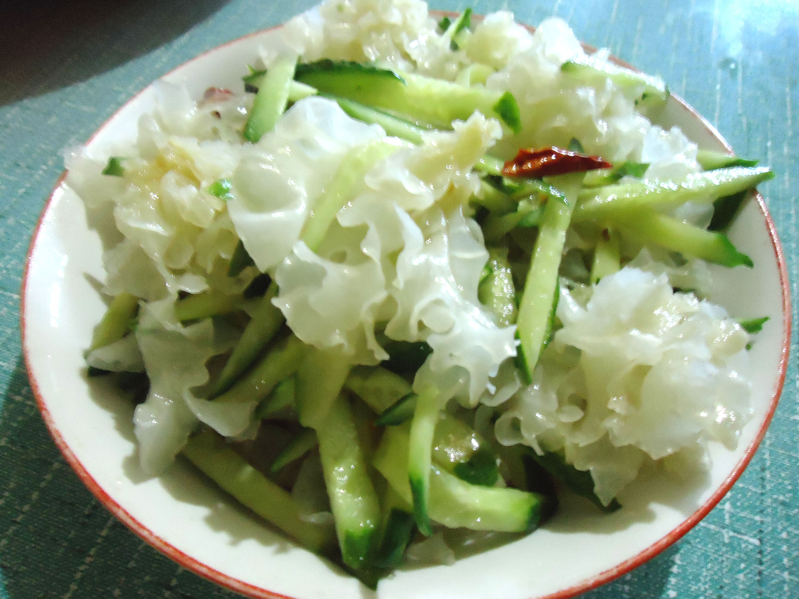

# 鼎湖上素雪耳 (Cantonese Dinghu Braised Tremella in Supreme Broth)

## 📋 基本資訊 / Recipe Overview
- **料理名稱 (繁體)**：鼎湖上素雪耳
- **料理名称 (简体)**：鼎湖上素雪耳
- **English Title**：Cantonese Dinghu Braised Tremella in Supreme Broth
- **素食流派 / Diet**：全素 / 纯素 Vegan (纯素无五辛；粤式顶级素斋名馔)
- **料理分類 / Category**：02-菌菇山珍类 / 粤菜素筵 / 鲜醇清雅
- **份量 / Servings**：2-3 人份
- **準備時間 / Prep Time**：20 分鐘
- **烹飪時間 / Cook Time**：15 分鐘
- **總計耗時 / Total Time**：35 分鐘
- **來源 / Source**：现代中华素菜 Top 100 · [02-菌菇山珍类.md](../02-菌菇山珍类.md) 第 18 道

## 📖 菜品特色 / Description
鼎湖上素用料里的雪耳。银耳在粤式上素里扣制围边，清雅。

---

## 🌿 食材與調味清單 / Ingredients & Seasonings
### 主料
- 特级精选雪耳（干银耳） 1 朵（约 20g，泡发后色白如玉、朵形完整）
- 广东菜心嫩胆 6-8 棵（焯熟用于围边）

### 调味料 / 配料
- 粤式纯素顶汤（由黄豆芽、香菇脚、冬笋、胡萝卜、玉米熬制） 350ml
- 生姜 2 片
- 白糖 1/2 茶匙（约 2.5g）
- 食盐 1/2 茶匙（约 2.5g）
- 顶级白酱油 / 浅色生抽 1 茶匙（约 5ml，不可用深色老抽以免染色）
- 水淀粉 2 汤匙（生粉 1 茶匙 + 素顶汤 2 汤匙）
- 纯正花生油 1.5 汤匙（约 22.5ml）
- 纯正芝麻麻油 1/3 茶匙

---

## 🍳 烹飪步驟 / Step-by-Step Cooking Steps
### 步骤 1：雪耳发制与精细修形
1. 干雪耳用温水充分浸泡 1.5 小时，彻底剪去黄色硬蒂，修剪成花球状或规整小朵，洗净沥水。

### 步骤 2：姜水滚焯去除干货异味
1. 锅中加水、2 片姜烧沸，下雪耳滚焯 1 分钟去除干货异味，捞出放入冷水中浸洗冲凉沥干。

### 步骤 3：分锅煨制注入素上汤
1. 粤菜“一料一灶”精髓：锅中倒入 250ml 素上汤，加入少许花生油、盐、白糖、浅色生抽。
2. 放入雪耳慢火煨煮 6-8 分钟，让洁白雪耳充分吸透素顶汤的醇厚鲜甜，捞出整齐扣入深盘中。

### 步骤 4：菜心围边与推玻璃二流芡
1. 菜心在素汤中焯熟整齐环绕码在雪耳四周。
2. 锅中余汤滤清，加剩余素顶汤大火烧开，淋入水淀粉推成晶莹剔透的二流玻璃芡，滴少许麻油，均匀浇淋在雪耳和菜心上。

---

## 💡 大厨秘诀 / Chef's Tips
1. **“一料一灶”独立煨制防串色**：鼎湖上素严禁杂菌一锅烩，雪耳必须单独清煨，不得接触老抽或深色香菇汁，才能确保成菜莹白如雪、宛如美玉。
2. **粤式素顶汤是鲜味灵魂**：黄豆芽搭配香菇根与胡萝卜熬出的素上汤甘醇清澈，赋予雪耳高雅的鲜甜底韵。
3. **二流玻璃芡薄亮如镜**：勾芡不可浓稠过厚，恰到好处的“二流芡”既能锁住上汤鲜汁，又使雪耳晶莹剔透，如凝脂白玉。

---
*食谱归档时间：2026-08-21 · 收录于 20260818-vegetarianism 本地菜谱库 (1Top 精选)*
