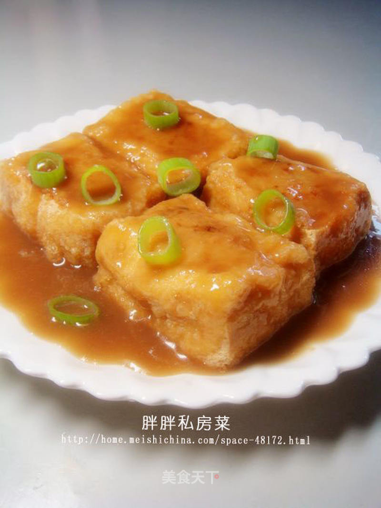

# --瓤豆腐

## 📋 基本資訊 / Recipe Overview
- **料理名稱**：--瓤豆腐
- **原始標題**：【徽菜】--瓤豆腐
- **素食流派 / Diet**：蛋素 Ovo-Vegetarian
- **料理分類 / Category**：面食主食
- **來源平台 / Source**：[美食天下 · 精華素食專區](https://home.meishichina.com/recipe-31564.html)

## 🌿 食材及佐料清單 / Ingredients
- 豆腐 500克 (主料)
- 精腿肉 100克 (辅料)
- 虾仁 适量 (辅料)
- 绿豆粉 10克 (辅料)
- 鸡蛋 3个 (辅料)
- 绍酒巴 适量 (配料)
- 白糖 50克 (配料)
- 姜末 5克 (配料)
- 味精 1.5克 (配料)
- 精盐 4克 (配料)
- 醋 15克 (配料)
- 豆油 1000克（约耗100克） (配料)
- 麻油 少许 (配料)
- 鲜汤 150克 (配料)
- 湿淀粉 15克 (配料)

## 🍳 烹飪步驟 / Step-by-Step Cooking Steps
1. 豆腐一块。
2. 将豆腐切成长方的小块。
3. 入开水锅焯一下，使豆腐硬功夫结。
4. 在每块豆腐中间切开一个小洞。
5. 先把虾仁洗净。
6. 切成碎末。
7. 把肉切碎，加盐、味精、姜末、虾仁，拌匀成馅料。
8. 把肉馅塞入豆腐中间。
9. 取鸡蛋清打成泡沫状。
10. 加绿豆粉拌成飞糊。
11. 炒锅上旺火，下油烧至四五成热，放入裹了飞糊的豆腐夹肉生坯。
12. 炸至豆腐外表起软壳。
13. 呈金黄色，捞出装盘。
14. 放到铺了吸油纸的盘子里。
15. 炒锅内留油少许，加糖、醋、绍酒、鲜汤烧开，用湿淀粉勾薄芡，淋麻油，浇在豆腐上即成。

---
*食譜歸檔時間：2026-08-20 · 來源：美食天下 (home.meishichina.com)*