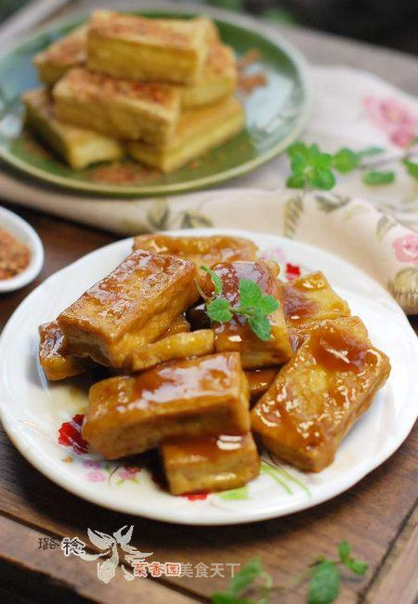

# 。椒盐脆豆腐 & 糖醋脆豆腐

## 📋 基本資訊 / Recipe Overview
- **料理名稱**：。椒盐脆豆腐 & 糖醋脆豆腐
- **原始標題**：【豆腐两吃】。椒盐脆豆腐 & 糖醋脆豆腐
- **素食流派 / Diet**：全素 Vegan
- **料理分類 / Category**：面食主食
- **來源平台 / Source**：[美食天下 · 精華素食專區](https://home.meishichina.com/recipe-103288.html)

## 🌿 食材及佐料清單 / Ingredients
- 锅烧豆腐 一块 (主料)
- 食用油 适量 (辅料)
- 辣椒粉 适量 (配料)
- 花椒粉 适量 (配料)
- 盐 适量 (配料)
- 味精 适量 (配料)
- 白糖 2勺 (配料)
- 醋 3勺 (配料)
- 六月鲜酱油 1勺 (配料)
- 水淀粉 2勺 (配料)

## 🍳 烹飪步驟 / Step-by-Step Cooking Steps
1. 锅烧豆腐一块，冲洗干净表面，控干水分。
2. 切成厚薄均匀的小方块。
3. 锅内倒入适量底油，将豆腐平铺在锅底，先煎黄一面。
4. 再翻面煎另一面，侧面记得也要煎一煎哟！豆腐的每一面都煎的金黄金黄的，就可以盛出锅了。
5. 按白糖2勺、醋3勺、盐半勺、六月鲜一勺，清水一勺、干淀粉一勺的比例调成糖醋汁，锅子留一点儿底油，烧热后将糖醋汁倒入。
6. 转大火，当汁子收浓后，将煎好的豆腐块倒入，拌匀，让每一块豆腐都均匀裹上糖醋汁即可，关火，
7. 装盘，上桌，趁热吃！
8. 椒盐口味：花椒粉+辣椒粉+少许盐混合
9. 炸好的豆腐蘸着吃~~

---
*食譜歸檔時間：2026-08-20 · 來源：美食天下 (home.meishichina.com)*