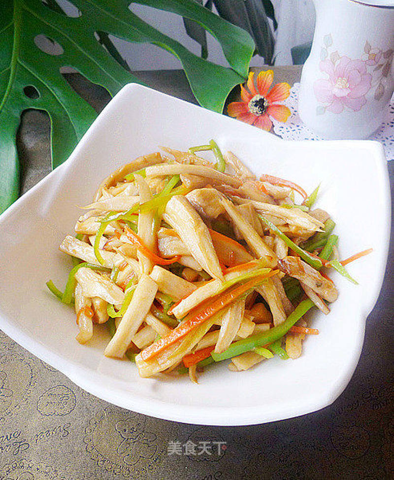

# 三丝杏鲍菇

## 📋 基本資訊 / Recipe Overview
- **料理名稱**：三丝杏鲍菇
- **原始標題**：三丝杏鲍菇
- **素食流派 / Diet**：全素 Vegan
- **料理分類 / Category**：家常蔬食 / 经典热菜
- **來源平台 / Source**：[美食天下 · 精華素食專區](https://home.meishichina.com/recipe-89688.html)

## 🌿 食材及佐料清單 / Ingredients
- 杏鲍菇 适量 (主料)
- 胡萝卜 适量 (主料)
- 尖椒 适量 (主料)
- 蚝油 适量 (辅料)
- 白糖 适量 (辅料)
- 食盐 适量 (辅料)
- 葱丝 适量 (辅料)

## 🍳 烹飪步驟 / Step-by-Step Cooking Steps
1. 原料:杏鲍菇、青椒、胡萝卜
2. 青椒胡萝卜分别切丝，杏鲍菇撕成丝。
3. 切些葱丝备用。
4. 炒锅烧热，放底油，放入葱丝爆香。
5. 放入胡萝卜丝煸软。
6. 放入杏鲍菇煸炒。（可淋入少许清水）
7. 煸炒至杏鲍菇变软，加入一大勺蚝油。
8. 加入少许食盐。
9. 加入一勺白糖提鲜，翻炒均匀。
10. 放入青椒丝煸炒。
11. 放入青椒稍稍煸炒断生即可。
12. 只用了蚝油调味，白糖提鲜，没有用太多的调料，却更能突出杏鲍菇的清香。

---
*食譜歸檔時間：2026-08-20 · 來源：美食天下 (home.meishichina.com)*