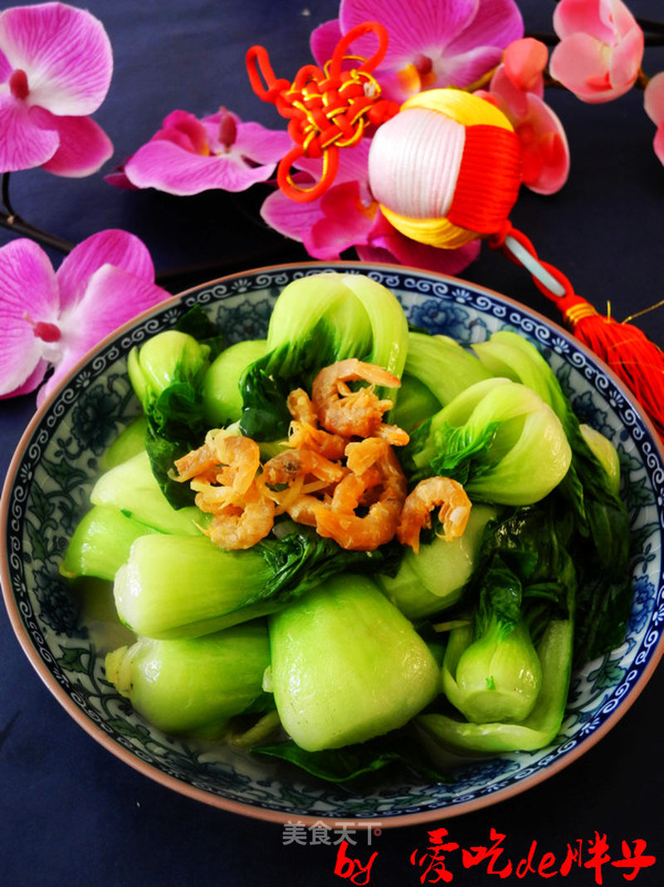

# 上海青炒海米

## 📋 基本資訊 / Recipe Overview
- **料理名稱**：上海青炒海米
- **原始標題**：上海青炒海米
- **素食流派 / Diet**：全素 Vegan
- **料理分類 / Category**：面食主食
- **來源平台 / Source**：[美食天下 · 精華素食專區](https://home.meishichina.com/recipe-124698.html)

## 🌿 食材及佐料清單 / Ingredients
- 上海青 150g (主料)
- 海米 20g (主料)
- 葱 5g (辅料)
- 姜 3g (辅料)
- 盐 3g (辅料)
- 花生油 20ml (辅料)
- 水淀粉 适量 (辅料)

## 🍳 烹飪步驟 / Step-by-Step Cooking Steps
1. 上海青洗净控水备用。
2. 海米洗净加少许温水泡软。
3. 热锅下油，放入葱姜炝锅。
4. 加入上海青翻炒至断生。
5. 加入海米以及泡还米的水和盐。
6. 旺火翻炒均匀。
7. 加入适量水淀粉。
8. 翻炒均匀出锅即可。

---
*食譜歸檔時間：2026-08-20 · 來源：美食天下 (home.meishichina.com)*