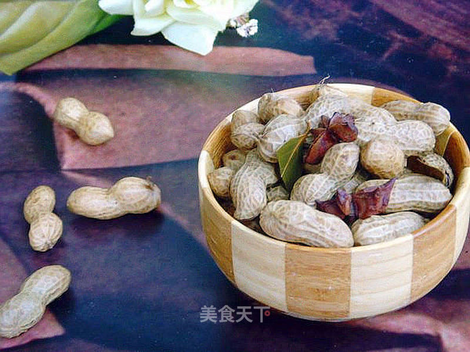

# 五香花生

## 📋 基本資訊 / Recipe Overview
- **料理名稱**：五香花生
- **原始標題**：五香花生
- **素食流派 / Diet**：全素 Vegan
- **料理分類 / Category**：面食主食
- **來源平台 / Source**：[美食天下 · 精華素食專區](https://home.meishichina.com/recipe-95358.html)

## 🌿 食材及佐料清單 / Ingredients
- 花生 1000克 (主料)
- 姜 适量 (辅料)
- 桂皮 1块 (辅料)
- 香叶 适量 (辅料)
- 花椒 适量 (辅料)
- 八角 5个 (辅料)
- 盐 适量 (配料)
- 五香粉 适量 (配料)
- 黑胡椒粉 适量 (配料)

## 🍳 烹飪步驟 / Step-by-Step Cooking Steps
1. 将花生表面仔细洗净
2. 用剪刀柄部将花生开一个小口
3. 八角、花椒、桂皮、香叶分别洗净
4. 姜切大片备用
5. 花生放入锅中，加足量清水、八角、香叶、花椒、桂皮、盐
6. 加些许黑胡椒粉
7. 再放入五香粉
8. 盖锅盖煮30分钟即可

---
*食譜歸檔時間：2026-08-20 · 來源：美食天下 (home.meishichina.com)*