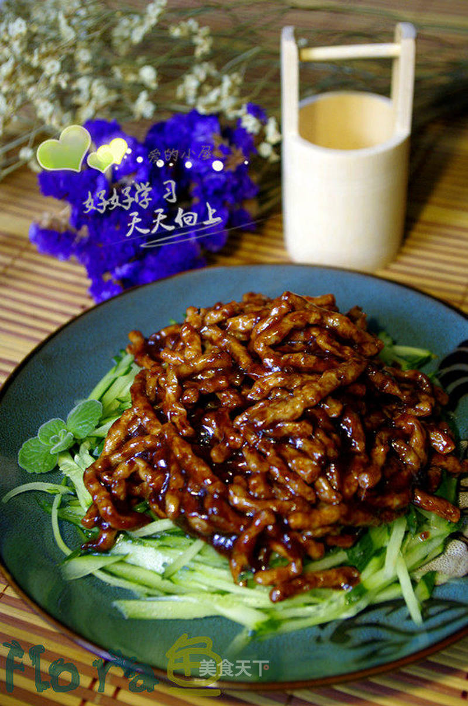

# 京酱素肉丝—素食

## 📋 基本資訊 / Recipe Overview
- **料理名稱**：京酱素肉丝—素食
- **原始標題**：京酱素肉丝—素食
- **素食流派 / Diet**：全素 Vegan
- **料理分類 / Category**：面食主食
- **來源平台 / Source**：[美食天下 · 精華素食專區](https://home.meishichina.com/recipe-87082.html)

## 🌿 食材及佐料清單 / Ingredients
- 素肉丝 一小碗 (主料)
- 黄瓜 一条 (辅料)
- 姜 三片 (辅料)
- 水淀粉 适量 (辅料)
- 甜面酱 小半碗 (配料)
- 糖 适量 (配料)
- 盐 少许（可不放） (配料)

## 🍳 烹飪步驟 / Step-by-Step Cooking Steps
1. 准备材料。（素肉丝、黄瓜、姜切片、甜面酱、水淀粉、糖、盐、容器）；
2. 将素肉丝用开水泡3-5分钟！（泡到用手抓起时蓬松的感觉）；
3. 黄瓜切丝，铺到容器底部备用；
4. 炒锅到油，油温3成时放入素肉丝炸到金黄色捞出控油！（家里用油煸炒也可以）；
5. 留底油，放入姜片煸炒后放入调好的甜面酱（甜面酱可以调入芝麻酱更香）；
6. 依照个人口味，加糖，盐（可不放）炒出酱香；
7. 放入之前炸好的素肉丝翻炒，使其裹上酱汁后用水淀粉勾薄芡翻炒均匀；
8. 起锅装入之前铺好黄瓜丝的盘中即可。

---
*食譜歸檔時間：2026-08-20 · 來源：美食天下 (home.meishichina.com)*