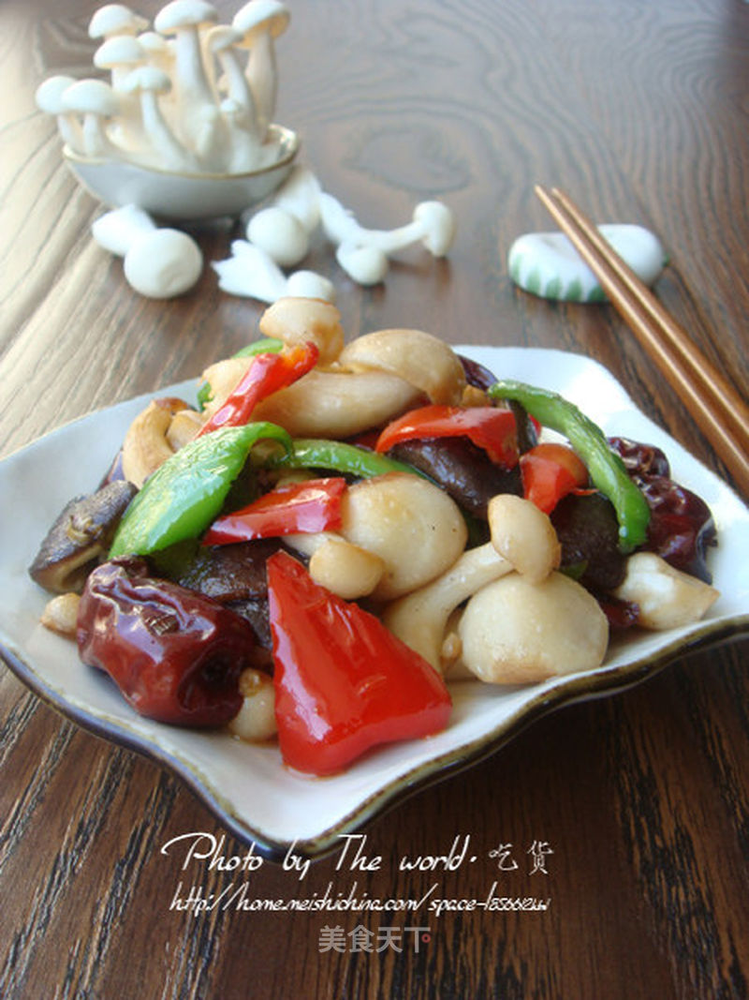

# 健康三宝——辣椒红枣爆双菇

## 📋 基本資訊 / Recipe Overview
- **料理名稱**：健康三宝——辣椒红枣爆双菇
- **原始標題**：健康三宝——辣椒红枣爆双菇
- **素食流派 / Diet**：全素 Vegan
- **料理分類 / Category**：面食主食
- **來源平台 / Source**：[美食天下 · 精華素食專區](https://home.meishichina.com/recipe-59068.html)

## 🌿 食材及佐料清單 / Ingredients
- 香菇 适量 (主料)
- 圆白菇 适量 (主料)
- 青椒 半个 (主料)
- 红椒 半个 (主料)
- 大枣 5个 (主料)
- 植物油 适量 (辅料)
- 盐 适量 (辅料)
- 味精 适量 (辅料)
- 胡椒粉 少量 (辅料)
- 料酒 适量 (辅料)
- 葱 少量 (辅料)

## 🍳 烹飪步驟 / Step-by-Step Cooking Steps
1. 材料图
2. 洗净的香菇、圆白菇用开水灼一下
3. 青红椒切片，红枣切半
4. 锅中烧油，倒入葱花和料酒，出香味后倒入香菇、圆白菇，炒熟后加入少量盐
5. 放入切好的大枣和生抽翻炒
6. 倒入青红椒片，加入味精和胡椒粉，快速翻炒即可

---
*食譜歸檔時間：2026-08-20 · 來源：美食天下 (home.meishichina.com)*