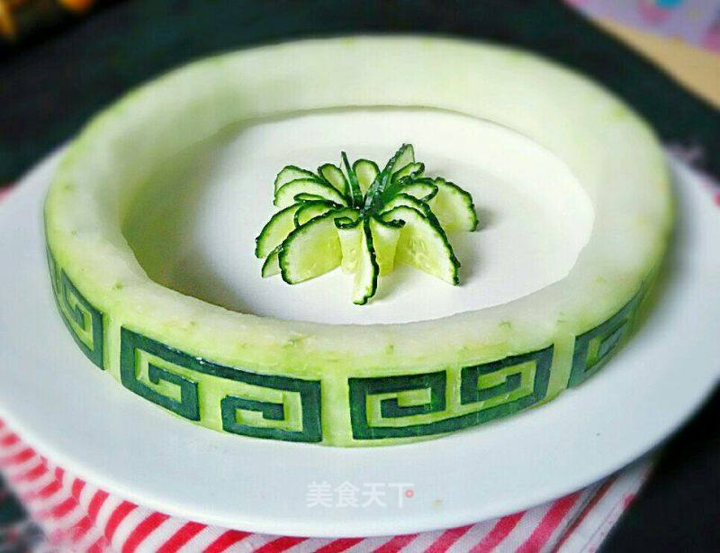

# 冬瓜花边雕刻

## 📋 基本資訊 / Recipe Overview
- **料理名稱**：冬瓜花边雕刻
- **原始標題**：冬瓜花边雕刻
- **素食流派 / Diet**：全素 Vegan
- **料理分類 / Category**：家常蔬食 / 经典热菜
- **來源平台 / Source**：[美食天下 · 精華素食專區](https://home.meishichina.com/recipe-224791.html)

## 🌿 食材及佐料清單 / Ingredients
- 冬瓜 1块 (主料)
- 雕刻刀 适量 (辅料)
- 笔 1个 (辅料)

## 🍳 烹飪步驟 / Step-by-Step Cooking Steps
1. 冬瓜处理好，雕刻刀准备好！
2. 然后用笔画出想雕刻的图案！
3. 用雕刻刀顺着画好的图案慢慢雕刻~
4. 然后就依次把画好的所有图案都刻好！
5. 成品欣赏！

---
*食譜歸檔時間：2026-08-20 · 來源：美食天下 (home.meishichina.com)*