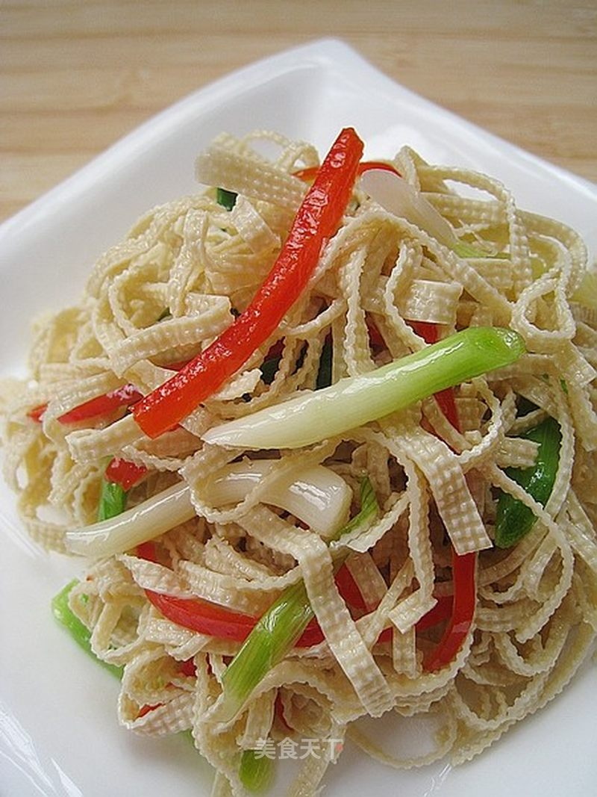

# 凉拌千张

## 📋 基本資訊 / Recipe Overview
- **料理名稱**：凉拌千张
- **原始標題**：凉拌千张
- **素食流派 / Diet**：全素 Vegan
- **料理分類 / Category**：爽口凉菜
- **來源平台 / Source**：[美食天下 · 精華素食專區](https://home.meishichina.com/recipe-55098.html)

## 🌿 食材及佐料清單 / Ingredients
- 千张 适量 (主料)
- 青椒 适量 (辅料)
- 青蒜 适量 (辅料)
- 红椒 适量 (辅料)
- 麻油 适量 (配料)
- 味精 适量 (配料)
- 生抽 适量 (配料)
- 盐 适量 (配料)
- 糖 适量 (配料)

## 🍳 烹飪步驟 / Step-by-Step Cooking Steps
1. 准备材料：豆皮一张、青红椒、青蒜。
2. 将豆皮切丝、辣椒切丝、青蒜切段。
3. 锅中兑水烧开、先将千张焯水、去除豆腥味。
4. 再将辣椒丝、青蒜段放入锅中和千张丝一同焯水。
5. 将焯水后的千张丝、辣椒丝、青蒜段捞出放入凉开水中过凉。
6. 将过凉后的千张丝、辣椒丝青蒜段控去水份、放入碗中加生抽、味精、盐、白糖、淋入麻油拌均匀就可以了。

---
*食譜歸檔時間：2026-08-20 · 來源：美食天下 (home.meishichina.com)*