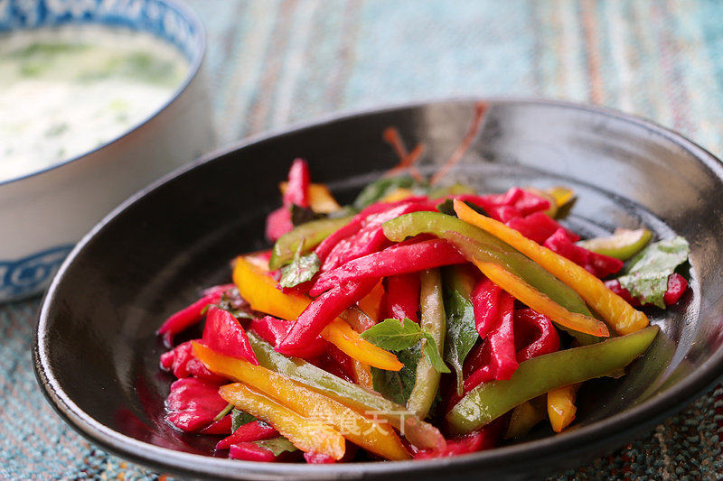

# 凉拌火龙果皮

## 📋 基本資訊 / Recipe Overview
- **料理名稱**：凉拌火龙果皮
- **原始標題**：凉拌火龙果皮
- **素食流派 / Diet**：全素 Vegan
- **料理分類 / Category**：面食主食
- **來源平台 / Source**：[美食天下 · 精華素食專區](https://home.meishichina.com/recipe-232079.html)

## 🌿 食材及佐料清單 / Ingredients
- 火龙果皮 一个 (主料)
- 黄甜椒 半个 (主料)
- 青甜椒 半个 (主料)
- 罗勒叶 适量 (主料)
- 盐 适量 (辅料)
- 胡椒粉 适量 (辅料)
- 橄榄油 适量 (辅料)
- 美极鲜味汁 适量 (辅料)

## 🍳 烹飪步驟 / Step-by-Step Cooking Steps
1. 剪去火龙果上的尖角。
2. 用刮皮刀削去外层薄皮，清洗干净。
3. 火龙果切4半，取出果肉。
4. 将将火龙果皮切成丝，青椒黄椒切同样的丝。
5. 放入盘中，加入盐、胡椒粉鲜味汁、罗勒叶和橄榄油调味。

---
*食譜歸檔時間：2026-08-20 · 來源：美食天下 (home.meishichina.com)*