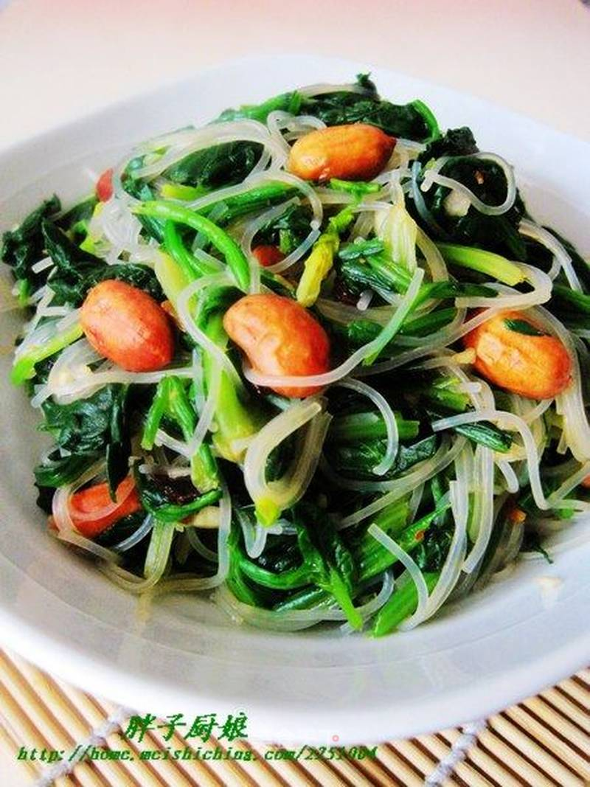

# 凉拌菠菜粉丝

## 📋 基本資訊 / Recipe Overview
- **料理名稱**：凉拌菠菜粉丝
- **原始標題**：凉拌菠菜粉丝
- **素食流派 / Diet**：全素 Vegan
- **料理分類 / Category**：面食主食
- **來源平台 / Source**：[美食天下 · 精華素食專區](https://home.meishichina.com/recipe-96505.html)

## 🌿 食材及佐料清單 / Ingredients
- 菠菜 适量 (主料)
- 粉丝 适量 (辅料)
- 花生仁 适量 (辅料)
- 盐 适量 (配料)
- 李锦记豆豉香辣酱 适量 (配料)
- 醋 适量 (配料)
- 蒜末 适量 (配料)
- 香油 适量 (配料)
- 鸡精 适量 (配料)

## 🍳 烹飪步驟 / Step-by-Step Cooking Steps
1. 原料图。
2. 锅中倒入适量水烧沸，放入菠菜焯水2分钟。
3. 将焯好的菠菜放入凉水中浸凉。
4. 将粉丝放入锅中煮至软烂捞出备用。
5. 将浸好的菠菜挤干水分，切成段备用。
6. 锅中放入适量油烧热，将洗干净的花生仁放入锅中炒熟。
7. 将花生凉凉。
8. 将波菜、粉丝、花生仁放入盆中，放入蒜末，辣酱，盐，醋，香油，鸡精拌匀即可食用。

---
*食譜歸檔時間：2026-08-20 · 來源：美食天下 (home.meishichina.com)*