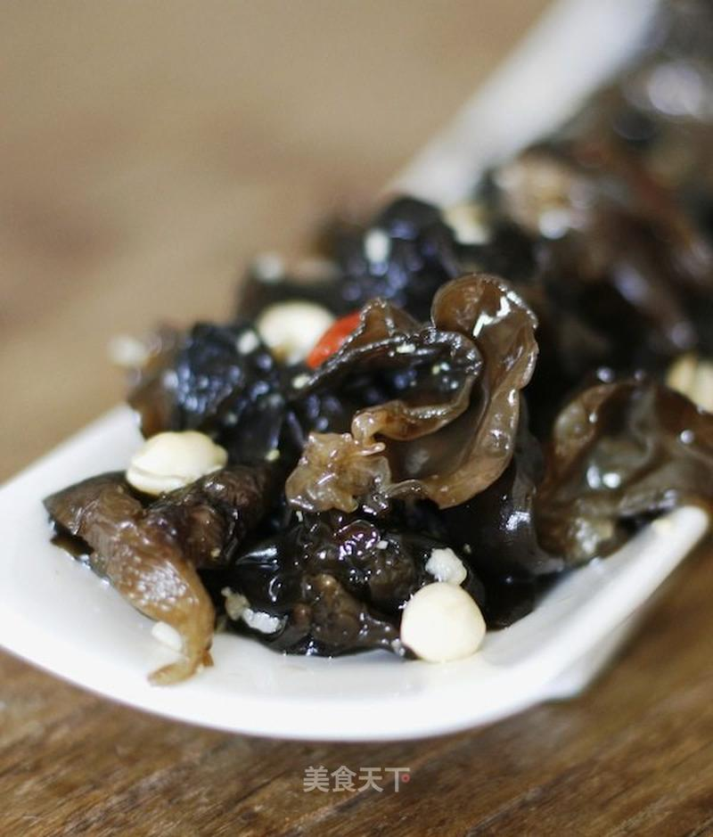

# 凉拌黑木耳

## 📋 基本資訊 / Recipe Overview
- **料理名稱**：凉拌黑木耳
- **原始標題**：凉拌黑木耳
- **素食流派 / Diet**：全素 Vegan
- **料理分類 / Category**：面食主食
- **來源平台 / Source**：[美食天下 · 精華素食專區](https://home.meishichina.com/recipe-90242.html)

## 🌿 食材及佐料清單 / Ingredients
- 黑木耳 20g (主料)
- 花生米 数粒 (辅料)
- 枸杞子 几粒 (辅料)
- 生抽 15ml (配料)
- 香醋 25ml (配料)
- 食用油 25ml (配料)
- 白糖 1.5勺 (配料)
- 花椒 适量 (配料)
- 八角料 1粒 (配料)
- 黑胡椒粉 适量 (配料)
- 白胡椒粉 适量 (配料)
- 盐 适量 (配料)
- 姜末 适量 (配料)
- 蒜末 适量 (配料)

## 🍳 烹飪步驟 / Step-by-Step Cooking Steps
1. 准备材料。木耳泡发，摘净。
2. 准备调料。
3. 洗净去根的木耳加点盐在沸水中焯烫2-3分钟即可。
4. 花生米浸泡，去皮，用开水烫快速一下。
5. 烫好的木耳过凉水，沥除多余水分。
6. 依次加入生抽、香醋、糖、盐、黑白胡椒粉（不放也可）。略拌一下。
7. 起火，上锅，入油，四五分热时放花椒和八角大料，中火煸一下，不要胡，出香味后关火。锅中留油，盛出调料。
8. 趁热下入姜、蒜沫，不用再点火，余热爆出香味。
9. 把调料油倒入木耳中，放入花生和枸杞，提奥宾纳、调拌均匀即可盛盘。

---
*食譜歸檔時間：2026-08-20 · 來源：美食天下 (home.meishichina.com)*