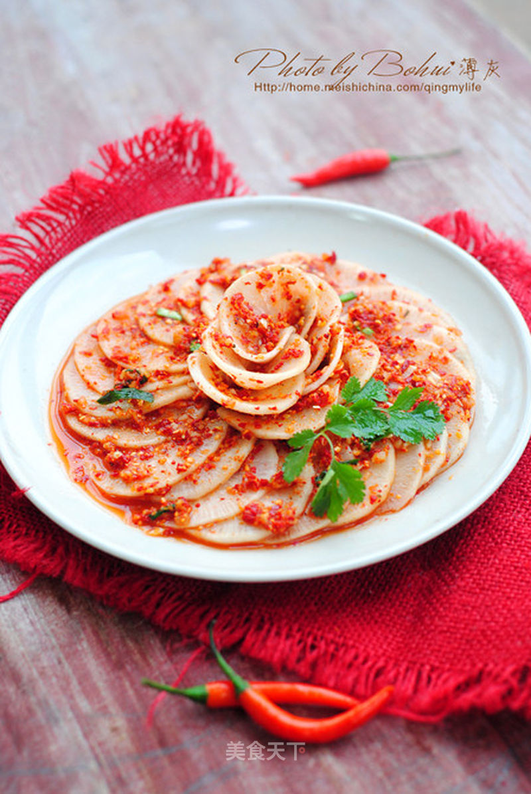

# 凉菜也可以宴客

## 📋 基本資訊 / Recipe Overview
- **料理名稱**：凉菜也可以宴客
- **原始標題**：【韩式辣萝卜】凉菜也可以宴客
- **素食流派 / Diet**：全素 Vegan
- **料理分類 / Category**：面食主食
- **來源平台 / Source**：[美食天下 · 精華素食專區](https://home.meishichina.com/recipe-47033.html)

## 🌿 食材及佐料清單 / Ingredients
- 白萝卜 1个 (主料)
- 辣椒面 60克 (主料)
- 虾皮 一小撮 (辅料)
- 韭菜 几根 (辅料)
- 苹果 1/3个 (辅料)
- 梨 1/3个 (辅料)
- 姜 2片 (配料)
- 蒜 5瓣 (配料)
- 盐 适量 (配料)
- 白糖 1小匙 (配料)
- 鱼露 30毫升 (配料)
- 糯米粉 10克 (配料)
- 清水 90克 (配料)

## 🍳 烹飪步驟 / Step-by-Step Cooking Steps
1. 准备所需材料。
2. 白萝卜撒少许盐，腌制20分钟至萝卜片菜变软，倒去腌出的水。
3. 苹果、梨切成碎末；白萝卜刨成丝；蒜、姜切碎末，韭菜洗净切成段，虾皮剁碎备用。
4. 将鱼露倒入辣椒面中。
5. 再加入切碎的苹果、梨、姜蒜末、白萝卜丝、韭菜、糖、盐。
6. 再加入切碎的虾皮拌匀。
7. 糯米粉10克与90克清水搅匀，小火煮成浆糊状。
8. 煮好的糯米浆糊倒入辣椒酱中.
9. 拌匀。
10. 将萝卜片上均匀的沾上辣椒酱。腌半天以上即可以食用。
11. 装盘食用。

---
*食譜歸檔時間：2026-08-20 · 來源：美食天下 (home.meishichina.com)*