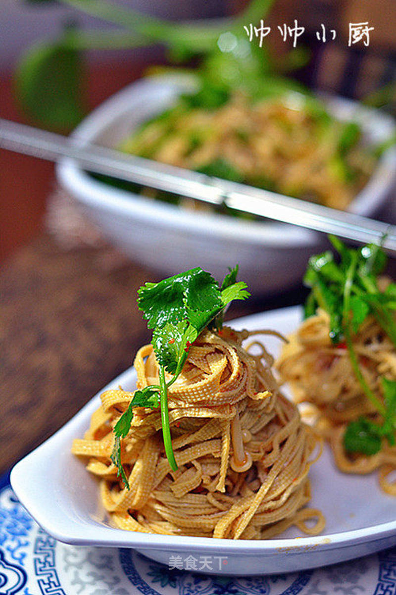

# 凉菜混搭之

## 📋 基本資訊 / Recipe Overview
- **料理名稱**：凉菜混搭之
- **原始標題**：凉菜混搭之【金针菇拌豆皮】
- **素食流派 / Diet**：全素 Vegan
- **料理分類 / Category**：家常蔬食 / 经典热菜
- **來源平台 / Source**：[美食天下 · 精華素食專區](https://home.meishichina.com/recipe-101588.html)

## 🌿 食材及佐料清單 / Ingredients
- 金针菇 适量 (主料)
- 豆皮 适量 (主料)
- 香菜 适量 (主料)
- 生抽 适量 (辅料)
- 油泼辣子 适量 (辅料)
- 盐 适量 (辅料)
- 糖 适量 (辅料)
- 鸡精 适量 (辅料)

## 🍳 烹飪步驟 / Step-by-Step Cooking Steps
1. 准备原料
2. 豆腐皮切丝，香菜切段
3. 金针菇用水烫
4. 豆腐皮焯水
5. 所有食材放入盆中
6. 生抽一大勺，香油一大勺，油泼辣子一小勺，糖一小勺，盐和鸡精适量，拌匀即可。

---
*食譜歸檔時間：2026-08-20 · 來源：美食天下 (home.meishichina.com)*