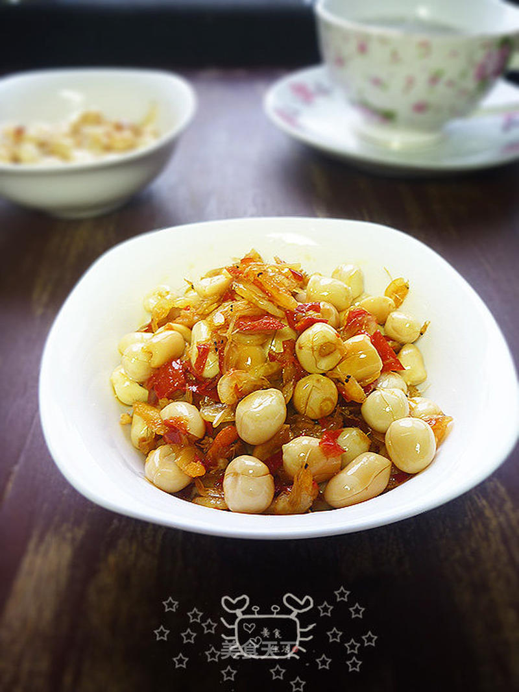

# 剁椒花生

## 📋 基本資訊 / Recipe Overview
- **料理名稱**：剁椒花生
- **原始標題**：剁椒花生
- **素食流派 / Diet**：全素 Vegan
- **料理分類 / Category**：家常蔬食 / 经典热菜
- **來源平台 / Source**：[美食天下 · 精華素食專區](https://home.meishichina.com/recipe-89248.html)

## 🌿 食材及佐料清單 / Ingredients
- 花生 适量 (主料)
- 剁椒 适量 (主料)
- 虾皮 适量 (辅料)
- 烹调油 适量 (配料)

## 🍳 烹飪步驟 / Step-by-Step Cooking Steps
1. 材料图。虾皮需要用水泡去多余的盐份，花生去掉红衣。
2. 上个图讲一个花生去皮的好方法，把花生放在烤盘中，160度，半小时左右，取出凉后用手搓，皮皮很容易去掉，去皮后的花生可以打豆浆，可以炒可以炸，可以煮粥，很方便。为什么要去皮呢？花生皮中含有类似于血小板样的物质，起凝血作用，对于成年人来说，不吃更好。
3. 虾皮泡水后在流动的水下冲洗几次淋水备用。
4. 炒锅倒油，凉油下花生。
5. 小火加热，用锅铲翻动。
6. 花生微黄时推至锅边，这个时间要把握好，稍不留心容易糊。
7. 锅边留油，下虾皮翻至酥香。
8. 倒入剁椒，我在此时已经盛出一部分，因虾皮本身是咸的，不用另外加盐
9. 翻炒均匀出锅。剁椒也是咸的，不用加盐。

---
*食譜歸檔時間：2026-08-20 · 來源：美食天下 (home.meishichina.com)*