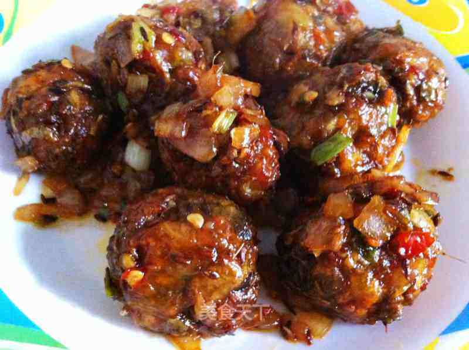

# 印度蔬菜球vegetable madchurian

## 📋 基本資訊 / Recipe Overview
- **料理名稱**：印度蔬菜球vegetable madchurian
- **原始標題**：印度蔬菜球vegetable madchurian
- **素食流派 / Diet**：全素 Vegan
- **料理分類 / Category**：面食主食
- **來源平台 / Source**：[美食天下 · 精華素食專區](https://home.meishichina.com/recipe-94412.html)

## 🌿 食材及佐料清單 / Ingredients
- 花椰菜 半小个 (主料)
- 红萝卜 半个 (主料)
- 绿辣椒 1个 (辅料)
- 葱花 适量 (辅料)
- 姜蒜蓉 适量 (辅料)
- 黑胡椒粉 适量 (配料)
- 孜然籽 1勺 (配料)
- 酱油 适量 (配料)
- 辣椒酱 适量 (配料)
- 糖 1勺 (配料)
- 面粉 适量 (配料)
- 盐 适量 (配料)
- 柠檬汁 适量 (配料)

## 🍳 烹飪步驟 / Step-by-Step Cooking Steps
1. 先把切碎的花椰菜，红萝卜和绿辣椒煮软，一般就是把菜放入开水里煮3分钟就好了，然后把菜放入面布或者纱布里把水过滤掉。
2. 加盐，黑胡椒粉，酱油，葱花，面粉搅匀，这里面粉可以自己拿捏，只要菜可以抓成一个小球的粘度就可以了，不用过量。
3. 这是捏好的菜球
4. 把菜球在面粉上滚一圈，裹上面粉
5. 把菜球放入热油里炸至外围有些焦黑
6. 这是炸好的菜球，先搁置一边
7. 热锅，加孜然籽，姜蒜蓉炒半分钟
8. 加入洋葱炒至褐色
9. 然后加入辣椒酱，黑胡椒粉，酱油，糖，葱花，少盐拌匀1分钟
10. 这是葱花
11. 再加入适量柠檬汁
12. 加入菜球烧至汤汁变没
13. 做好了，可以滴少量柠檬汁在上面。

---
*食譜歸檔時間：2026-08-20 · 來源：美食天下 (home.meishichina.com)*