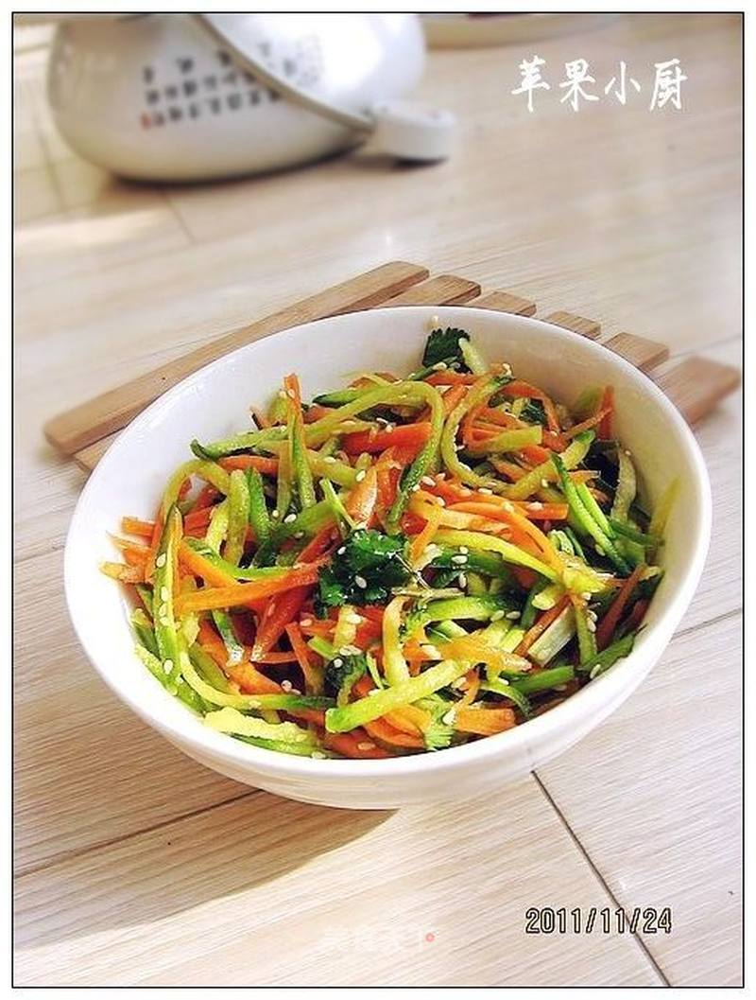

# 双拌萝卜丝

## 📋 基本資訊 / Recipe Overview
- **料理名稱**：双拌萝卜丝
- **原始標題**：双拌萝卜丝
- **素食流派 / Diet**：全素 Vegan
- **料理分類 / Category**：家常蔬食 / 经典热菜
- **來源平台 / Source**：[美食天下 · 精華素食專區](https://home.meishichina.com/recipe-106038.html)

## 🌿 食材及佐料清單 / Ingredients
- 绿萝卜 适量 (主料)
- 胡萝卜 适量 (主料)
- 香菜 适量 (辅料)
- 熟芝麻 适量 (辅料)
- 盐 适量 (配料)
- 虾油 适量 (配料)
- 鲜鸡汁 适量 (配料)

## 🍳 烹飪步驟 / Step-by-Step Cooking Steps
1. 准备材料。
2. 绿萝卜擦成丝。
3. 胡萝卜也擦成丝。
4. 香菜切段放在盘中。
5. 加入自制的虾油。
6. 加入盐。
7. 加入鲜鸡汁、盐。
8. 加入熟白芝麻。
9. 拌匀即可。

---
*食譜歸檔時間：2026-08-20 · 來源：美食天下 (home.meishichina.com)*