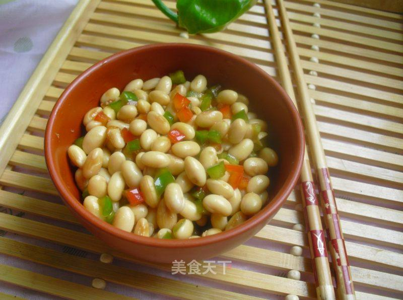

# 双椒拌黄豆

## 📋 基本資訊 / Recipe Overview
- **料理名稱**：双椒拌黄豆
- **原始標題**：双椒拌黄豆
- **素食流派 / Diet**：全素 Vegan
- **料理分類 / Category**：家常蔬食 / 经典热菜
- **來源平台 / Source**：[美食天下 · 精華素食專區](https://home.meishichina.com/recipe-92388.html)

## 🌿 食材及佐料清單 / Ingredients
- 黄豆 100克 (主料)
- 红甜椒 半个 (辅料)
- 青甜椒 半个 (辅料)
- 油 适量 (配料)
- 盐 适量 (配料)
- 生抽 适量 (配料)
- 糖 适量 (配料)
- 花椒油 适量 (配料)

## 🍳 烹飪步驟 / Step-by-Step Cooking Steps
1. 准备材料。
2. 黄豆浸泡一夜。
3. 将黄豆放入锅中煮20分钟。
4. 将煮好的黄豆过一下凉水，这样处理后的黄豆口感比较好哇！
5. 将青红椒切成小丁。
6. 将黄豆和青红椒丁放在一个碗中，加一勺生抽。
7. 半勺盐。
8. 一点点糖，只要一点点儿，目的是提鲜，不能让菜感觉到甜味儿。
9. 锅中倒入油，将油烧至冒烟。趁热倒入碗中，拌匀。
10. 最后淋一勺花椒油。
11. 下酒小菜。

---
*食譜歸檔時間：2026-08-20 · 來源：美食天下 (home.meishichina.com)*