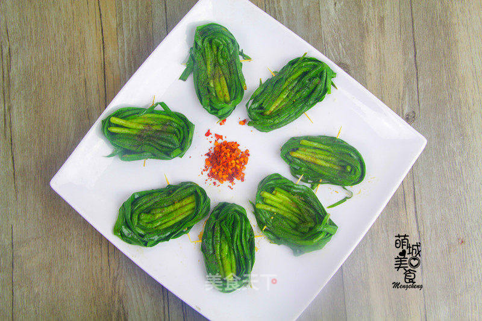

# 啤酒伴侣--烤韭菜

## 📋 基本資訊 / Recipe Overview
- **料理名稱**：啤酒伴侣--烤韭菜
- **原始標題**：啤酒伴侣--烤韭菜
- **素食流派 / Diet**：全素 Vegan
- **料理分類 / Category**：面食主食
- **來源平台 / Source**：[美食天下 · 精華素食專區](https://home.meishichina.com/recipe-232082.html)

## 🌿 食材及佐料清單 / Ingredients
- 韭菜 适量 (主料)
- 食盐 适量 (辅料)
- 胡椒粉 适量 (辅料)
- 油 适量 (辅料)

## 🍳 烹飪步驟 / Step-by-Step Cooking Steps
1. 把韭菜洗净
2. 烧开水放少量盐和几滴油，韭菜放入焯一下，迅速捞出冷水过凉。
3. 三四根韭菜一起摆整齐从根部开始慢慢卷起成卷，卷紧,用牙签从卷好的韭菜卷中间穿过。依次卷好所有的韭菜，放入已放锡纸的烤盘中。
4. 在韭菜卷上均匀地刷一层油，撒上食盐、胡椒粉
5. 放入已预热的烤箱，最底层，上下火150度，烤3分钟即可。
6. 出炉啰~

---
*食譜歸檔時間：2026-08-20 · 來源：美食天下 (home.meishichina.com)*