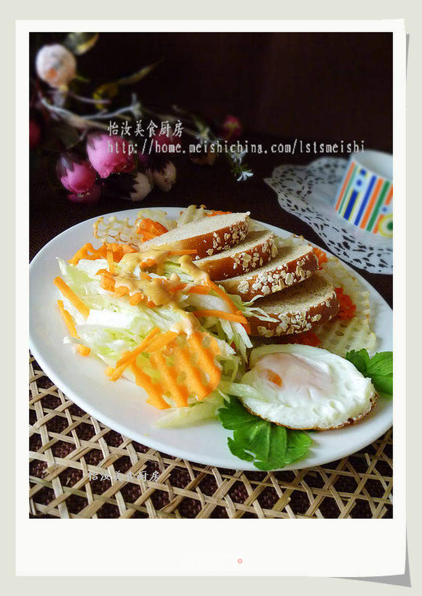

# 在家做简单营养早餐---燕麦全麦面包早餐

## 📋 基本資訊 / Recipe Overview
- **料理名稱**：在家做简单营养早餐---燕麦全麦面包早餐
- **原始標題**：在家做简单营养早餐---燕麦全麦面包早餐
- **素食流派 / Diet**：蛋素 Ovo-Vegetarian
- **料理分類 / Category**：面食主食
- **來源平台 / Source**：[美食天下 · 精華素食專區](https://home.meishichina.com/recipe-49056.html)

## 🌿 食材及佐料清單 / Ingredients
- 全麦面包 适量 (主料)
- 鸡蛋 一个 (主料)
- 土豆 一个 (辅料)
- 胡萝卜 三分之一 (辅料)
- 生菜 100克 (辅料)
- 千岛酱 适量 (配料)

## 🍳 烹飪步驟 / Step-by-Step Cooking Steps
1. 早餐食材---去皮的土豆和胡萝卜。
2. 早餐食材---燕麦全麦面包片。
3. 土豆和胡萝卜切成片。
4. 我们可以先把面包片放入烤箱200度烤3-5分钟。
5. 等面包烤好装盘再把土豆胡萝卜放入烤箱220度上下火烤8分钟。
6. 然后在等待烤土豆和胡萝卜时，先把洗红的生菜切好放入盘，再用平底锅煎鸡蛋。
7. 土豆胡萝卜烤好出炉。
8. 然后把土豆和胡萝卜摆放在盘中，放上面包片，我把鸡蛋弄成爱心型码放边上，为了不浪费，我把切碎的胡萝卜也放在生菜上了，再滴上千岛酱早餐就ok了。我用的是【苏泊尔煎锅】不放油也不粘，我滴了一点，都跑了。

---
*食譜歸檔時間：2026-08-20 · 來源：美食天下 (home.meishichina.com)*