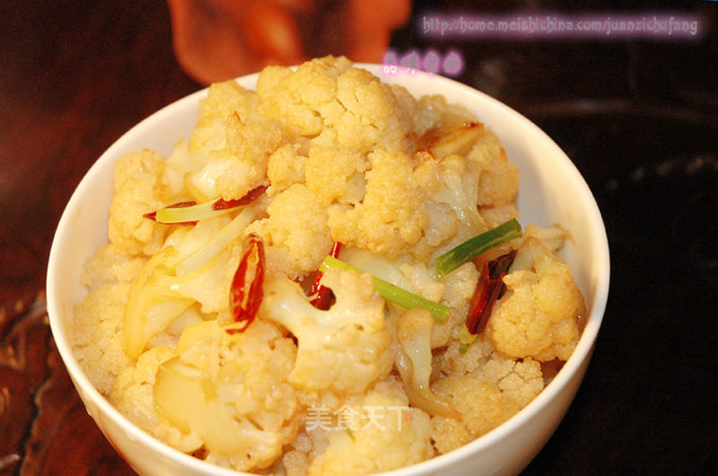

# 大碗菜花

## 📋 基本資訊 / Recipe Overview
- **料理名稱**：大碗菜花
- **原始標題**：大碗菜花
- **素食流派 / Diet**：全素 Vegan
- **料理分類 / Category**：家常蔬食 / 经典热菜
- **來源平台 / Source**：[美食天下 · 精華素食專區](https://home.meishichina.com/recipe-95795.html)

## 🌿 食材及佐料清單 / Ingredients
- 菜花 450克 (主料)
- 小红辣椒 3个 (辅料)
- 蒜 4瓣 (配料)
- 小香葱 6棵 (配料)
- 蚝油 15ml (配料)
- 盐 3克 (配料)
- 油 适量 (配料)

## 🍳 烹飪步驟 / Step-by-Step Cooking Steps
1. 菜花掰成均匀的小朵放入盐水里浸泡片刻（如果菜花有虫子经过盐水浸泡，虫子会从花朵里跑出来。）
2. 蒜拍松、小辣椒斜切成粒、香葱切寸段。
3. 洗净的菜花在沸水中涮烫一下捞出沥干水分。
4. 锅里倒适量油烧热爆香蒜和小辣椒。
5. 加入菜花翻炒均匀。
6. 菜花炒至微干调入耗油、盐翻炒均匀。
7. 加入香葱翻炒即可。

---
*食譜歸檔時間：2026-08-20 · 來源：美食天下 (home.meishichina.com)*