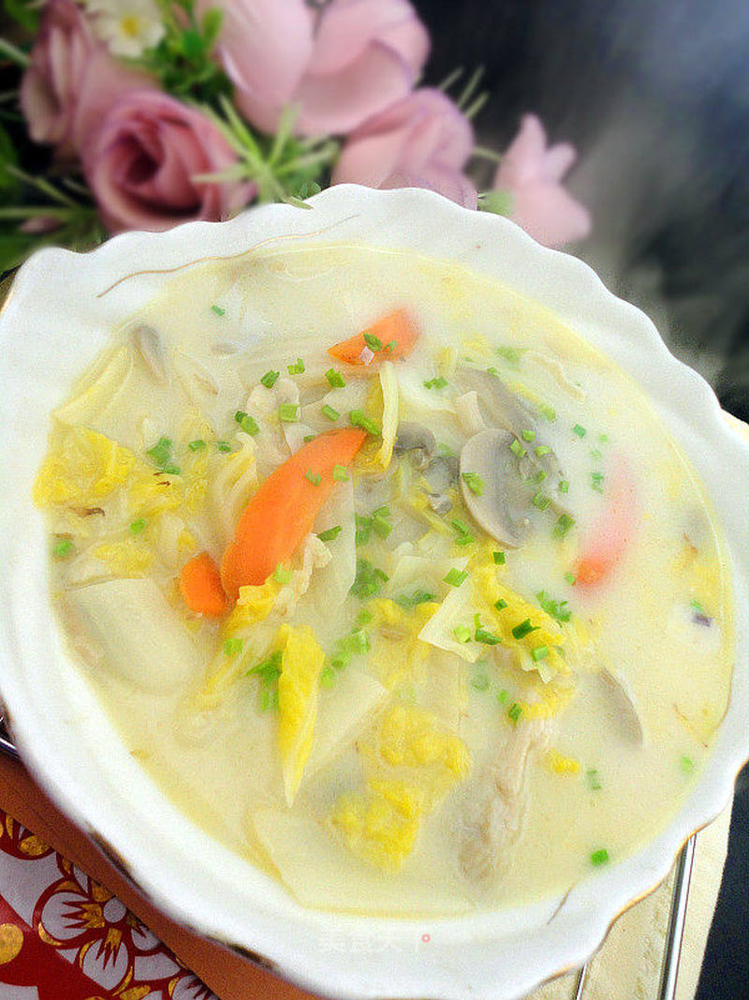

# 奶香白菜汤

## 📋 基本資訊 / Recipe Overview
- **料理名稱**：奶香白菜汤
- **原始標題**：奶香白菜汤
- **素食流派 / Diet**：奶素 Lacto-Vegetarian
- **料理分類 / Category**：养生汤品
- **來源平台 / Source**：[美食天下 · 精華素食專區](https://home.meishichina.com/recipe-44676.html)

## 🌿 食材及佐料清單 / Ingredients
- 白菜心 半棵 (主料)
- 蘑菇 适量 (辅料)
- 胡萝卜 适量 (辅料)
- 平菇 适量 (辅料)
- 盐 适量 (配料)
- 牛奶 适量 (配料)
- 鸡精 适量 (配料)

## 🍳 烹飪步驟 / Step-by-Step Cooking Steps
1. 洗好白菜、蘑菇、平菇。
2. 切好葱、姜，拍好蒜。
3. 切好白菜、胡萝卜、平菇、蘑菇。
4. 锅中入油，烧热，入葱、姜、蒜炸香。
5. 先放入胡萝卜炒一炒。
6. 再入白菜炒，炒到塌下去。
7. 加入开水，放入平菇和蘑菇，拌匀了盖上盖子烧2分钟。
8. 开盖加入牛奶。
9. 加入鸡精、盐出锅。

---
*食譜歸檔時間：2026-08-20 · 來源：美食天下 (home.meishichina.com)*