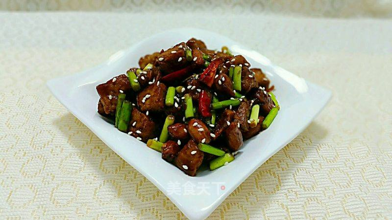

# 宫保豆腐

## 📋 基本資訊 / Recipe Overview
- **料理名稱**：宫保豆腐
- **原始標題**：宫保豆腐
- **素食流派 / Diet**：全素 Vegan
- **料理分類 / Category**：面食主食
- **來源平台 / Source**：[美食天下 · 精華素食專區](https://home.meishichina.com/recipe-232354.html)

## 🌿 食材及佐料清單 / Ingredients
- 豆腐 300克 (主料)
- 花生 100克 (主料)
- 蒜苔 90克 (主料)
- 干辣椒 5个 (主料)
- 白糖 1勺 (辅料)
- 醋 1勺 (辅料)
- 生抽 2勺 (辅料)
- 料酒 1勺 (辅料)
- 淀粉 1勺 (辅料)
- 白芝麻 适量 (辅料)
- 盐 2克 (辅料)

## 🍳 烹飪步驟 / Step-by-Step Cooking Steps
1. 豆腐切一厘米见方的小块备用
2. 蒜苔切一厘米长的段备用
3. 辣椒切段
4. 葱切小段姜切丝
5. 锅中加油，烧热下入豆腐炸制
6. 炸到表面金黄捞出沥油备用
7. 锅里留少许油炸熟花生米备用
8. 料酒、生抽、糖、盐、醋调成汁
9. 锅里留底油，下入葱姜和辣椒爆香
10. 把调好的汁倒入
11. 调料汁烧开后下入炸好的豆腐翻炒片刻
12. 再下入蒜苔和花生米翻炒
13. 一勺淀粉加适量清水调成水淀粉
14. 倒入水淀粉勾芡，翻炒均匀即可
15. 装盘，撒少许白芝麻装饰即可享用

---
*食譜歸檔時間：2026-08-20 · 來源：美食天下 (home.meishichina.com)*