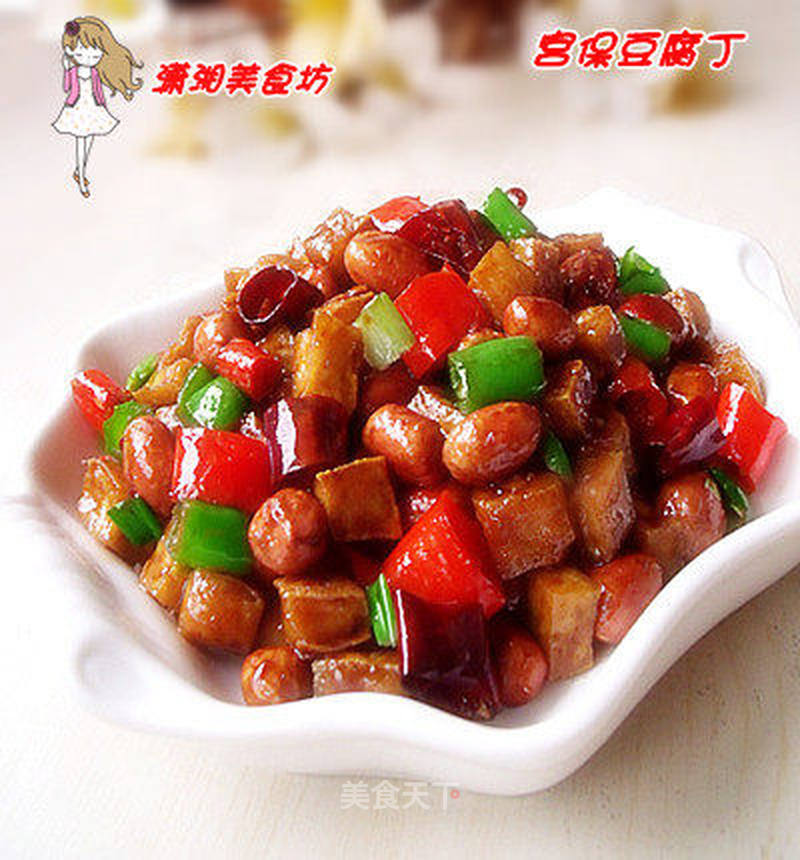

# 宫保豆腐丁

## 📋 基本資訊 / Recipe Overview
- **料理名稱**：宫保豆腐丁
- **原始標題**：宫保豆腐丁
- **素食流派 / Diet**：全素 Vegan
- **料理分類 / Category**：面食主食
- **來源平台 / Source**：[美食天下 · 精華素食專區](https://home.meishichina.com/recipe-103154.html)

## 🌿 食材及佐料清單 / Ingredients
- 豆腐 1块 (主料)
- 花生仁 70克 (主料)
- 青尖椒 2根 (辅料)
- 红尖椒 1根 (辅料)
- 干红辣椒 5个 (辅料)
- 蒜 1瓣 (辅料)
- 姜 适量 (辅料)
- 葱 1根 (辅料)
- 花椒粒 适量 (辅料)
- 酱油 适量 (配料)
- 生抽 适量 (配料)
- 醋 适量 (配料)
- 白糖 适量 (配料)
- 鸡精 适量 (配料)
- 味精 少许 (配料)
- 水淀粉 适量 (配料)
- 盐 少许 (配料)
- 玉米油 适量 (配料)

## 🍳 烹飪步驟 / Step-by-Step Cooking Steps
1. 准备好需用的原料。将调料除盐和玉米油之外，其余全部用小碗装好，搅匀即是味汁。
2. 烧热炒锅到入玉米油（稍多一点），将豆腐切成约0.8CM的小丁，放入过油至表面略干、颜色变黄时，捞出待用。
3. 花生仁放入油锅中，过油炒至酥香捞出。
4. 过油后的花生仁和豆腐丁。
5. 青、红尖椒洗净后切小颗，干红辣椒去籽剪成小段，姜、蒜切末，葱切小颗，花椒粒适量（补拍进来）
6. 炒锅中留适量底油，放入花椒粒和干红辣椒段炒香。
7. 放入青、红椒略炒后，调入少许盐炒匀。
8. 放入豆腐丁翻炒均匀。
9. 加入花生仁炒匀。
10. 烹入调好的味汁翻炒均匀。
11. 最后撒入葱颗炒匀即可装盘。

---
*食譜歸檔時間：2026-08-20 · 來源：美食天下 (home.meishichina.com)*