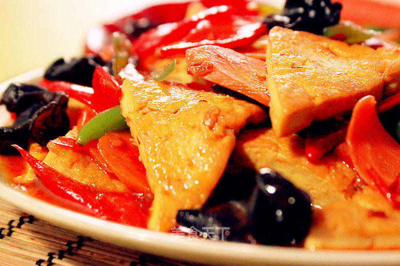

# 家常豆腐

## 📋 基本資訊 / Recipe Overview
- **料理名稱**：家常豆腐
- **原始標題**：家常豆腐
- **素食流派 / Diet**：全素 Vegan
- **料理分類 / Category**：面食主食
- **來源平台 / Source**：[美食天下 · 精華素食專區](https://home.meishichina.com/recipe-98728.html)

## 🌿 食材及佐料清單 / Ingredients
- 老豆腐 适量 (主料)
- 胡萝卜 适量 (辅料)
- 木耳 适量 (辅料)
- 青辣椒 适量 (辅料)
- 红辣椒 适量 (辅料)
- 姜 适量 (配料)
- 豆瓣酱 适量 (配料)
- 盐 适量 (配料)
- 白糖 适量 (配料)
- 鸡精 适量 (配料)
- 水淀粉 适量 (配料)

## 🍳 烹飪步驟 / Step-by-Step Cooking Steps
1. 木耳提前用水泡发，洗净备用
2. 胡萝卜、青辣椒、红辣椒分别切片
3. 老豆腐切成约1CM厚的三角形片
4. 平底锅热油，放入豆腐片煎到两面金黄后盛出备用
5. 锅中热油，挖一大勺的豆瓣酱炒至出红油，放入姜片煸香
6. 倒入胡萝卜片、青辣椒、红辣椒和黑木耳翻炒
7. 倒入煎好的豆腐块，调入盐，白糖，再加少许清水煮1-2分钟，令豆腐入味
8. 最后水淀粉勾簿茨，鸡精调味，大火收汁即可！

---
*食譜歸檔時間：2026-08-20 · 來源：美食天下 (home.meishichina.com)*