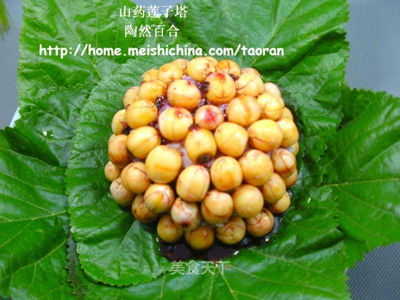

# 山药莲子塔

## 📋 基本資訊 / Recipe Overview
- **料理名稱**：山药莲子塔
- **原始標題**：山药莲子塔
- **素食流派 / Diet**：全素 Vegan
- **料理分類 / Category**：家常蔬食 / 经典热菜
- **來源平台 / Source**：[美食天下 · 精華素食專區](https://home.meishichina.com/recipe-85089.html)

## 🌿 食材及佐料清單 / Ingredients
- 鲜莲子 250克 (主料)
- 鲜山药 250克 (主料)
- 冰晶糖 15克 (辅料)
- 蓝莓酱 15克 (辅料)
- 桑叶 4-6片 (辅料)

## 🍳 烹飪步驟 / Step-by-Step Cooking Steps
1. 原料图
2. 鲜莲子去外壳去芯（莲芯不好去除，故偷懒了），洗净上蒸笼蒸熟；
3. 洗净山药，放进蒸锅里，用中火蒸20分钟左右；
4. 山药蒸好后，取出山药，把蒸好的山药去掉皮，然后找出一个细纱网（有那种药用的细箩最好）倒扣在案板上，把去皮的山药用细纱网箩一遍，这样箩出来的山药泥的口感会非常好！
5. 箩好的山药泥非常细腻且带有弹性。
6. 莲子蒸好后，从蒸笼里取出装盘中，山药泥从纱网上刮下来（可加点白沙糖拌匀，我不喜欢很甜的，故没再添加），另备好一个干净的碗，这样做莲子塔的材料就备好了；
7. 取一个干净的饭碗（碗不宜是直身的，那样不易叠加莲子），将莲子沿碗四周围慢慢重叠排列，就做好了莲子塔的外形；
8. 将山药泥小心的置于碗内，再轻轻的压实；
9. 将做好的莲子塔放蒸笼里再中火蒸10分钟，此步是为了山药泥与莲子更紧实，口感更好；
10. 奶锅里放进蓝莓酱与冰晶糖，然后再加少许开水调匀，小火加热至糖融化、蓝莓酱成稀糊状即可；
11. 桑叶洗净并放开水里浸几秒，沥干水份，剪去叶柄，平铺于碟上；
12. 山药莲子塔蒸好后，小心取出，然后将碗倒扣于桑叶上，再淋上蓝莓酱。

---
*食譜歸檔時間：2026-08-20 · 來源：美食天下 (home.meishichina.com)*