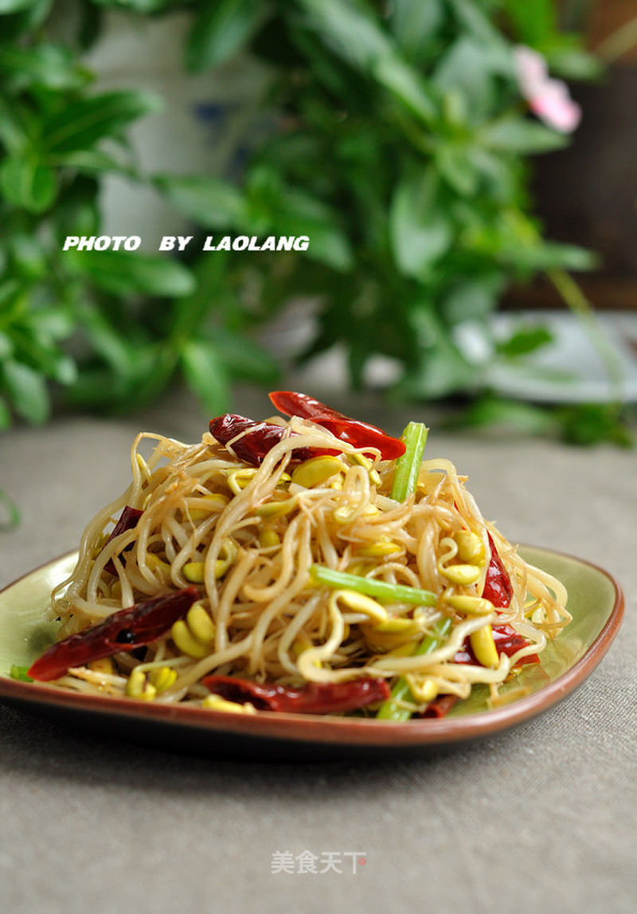

# 干煸黑豆芽

## 📋 基本資訊 / Recipe Overview
- **料理名稱**：干煸黑豆芽
- **原始標題**：干煸黑豆芽
- **素食流派 / Diet**：全素 Vegan
- **料理分類 / Category**：家常蔬食 / 经典热菜
- **來源平台 / Source**：[美食天下 · 精華素食專區](https://home.meishichina.com/recipe-78848.html)

## 🌿 食材及佐料清單 / Ingredients
- 黑豆芽 适量 (主料)
- 精盐 适量 (辅料)
- 油 适量 (辅料)
- 干红椒 适量 (辅料)
- 生姜 适量 (辅料)
- 酱油 适量 (辅料)
- 花椒 适量 (辅料)

## 🍳 烹飪步驟 / Step-by-Step Cooking Steps
1. 黑豆芽洗净，干红椒切段、生姜切小片。
2. 锅里油热后放入干红椒段、生姜片、花椒爆香。
3. 倒入黑豆芽，大火翻炒。
4. 加少许精盐。
5. 倒入1/2汤匙酱油，大火煸炒至没有水汽即可。

---
*食譜歸檔時間：2026-08-20 · 來源：美食天下 (home.meishichina.com)*