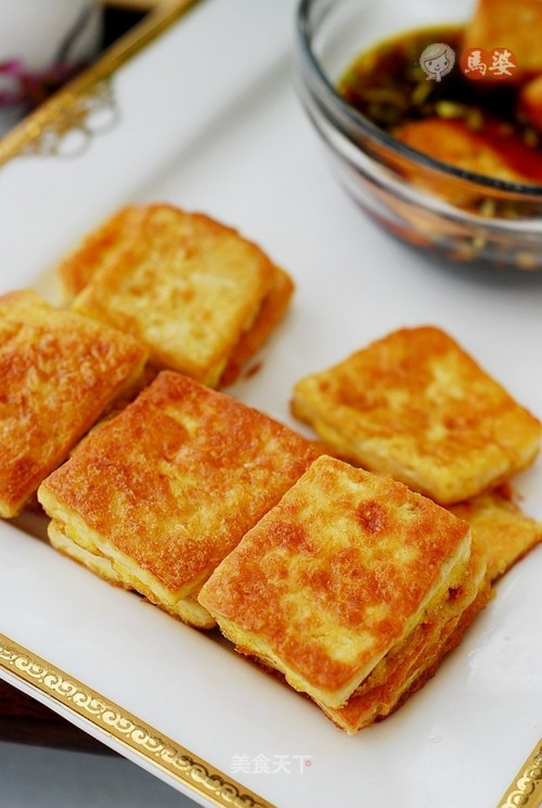

# 开胃素菜---脆皮豆腐

## 📋 基本資訊 / Recipe Overview
- **料理名稱**：开胃素菜---脆皮豆腐
- **原始標題**：开胃素菜---脆皮豆腐
- **素食流派 / Diet**：蛋素 Ovo-Vegetarian
- **料理分類 / Category**：家常蔬食 / 经典热菜
- **來源平台 / Source**：[美食天下 · 精華素食專區](https://home.meishichina.com/recipe-85295.html)

## 🌿 食材及佐料清單 / Ingredients
- 北豆腐 400克 (主料)
- 鸡蛋 1个 (辅料)
- 青辣椒 1个 (辅料)
- 咸菜 1小块 (辅料)
- 蒜瓣 3个 (辅料)
- 花生油 1勺 (辅料)
- 生抽 2勺 (配料)
- 白糖 适量 (配料)
- 香油 适量 (配料)
- 醋 半勺 (配料)

## 🍳 烹飪步驟 / Step-by-Step Cooking Steps
1. 豆腐控干水切大小一致的块。
2. 鸡蛋搅拌成液。
3. 豆腐块放鸡蛋液蘸均匀，同时煎锅放油置火上。
4. 油烧7成热，放入蘸鸡蛋液的豆腐块。
5. 两面煎金黄出锅装盘。
6. 青椒、咸菜和蒜瓣切碎。
7. 加入生抽、醋、白糖和香油，调汁。
8. 豆腐蘸酱汁食用。

---
*食譜歸檔時間：2026-08-20 · 來源：美食天下 (home.meishichina.com)*