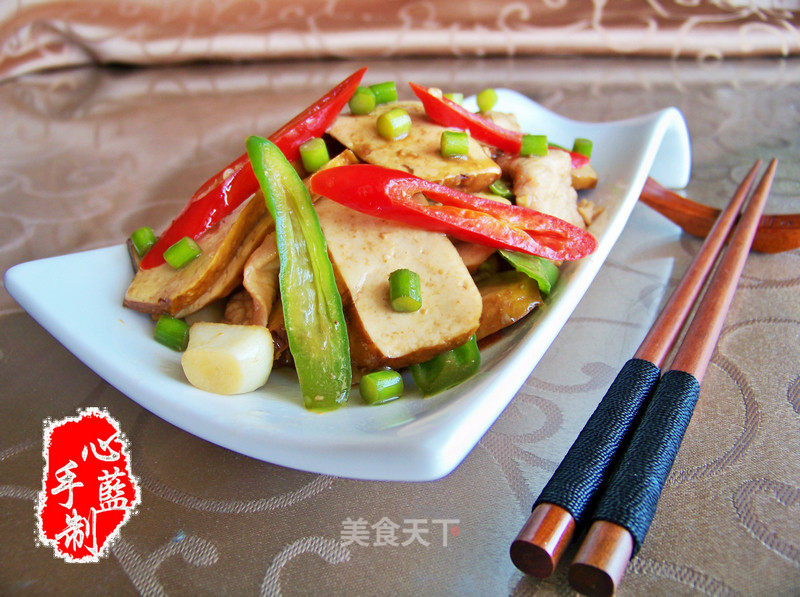

# 心蓝手制私房菜——与时尚绝缘

## 📋 基本資訊 / Recipe Overview
- **料理名稱**：心蓝手制私房菜——与时尚绝缘
- **原始標題**：心蓝手制私房菜【小炒攸县香干】——与时尚绝缘
- **素食流派 / Diet**：全素 Vegan
- **料理分類 / Category**：家常蔬食 / 经典热菜
- **來源平台 / Source**：[美食天下 · 精華素食專區](https://home.meishichina.com/recipe-80568.html)

## 🌿 食材及佐料清單 / Ingredients
- 攸县香干 500g (主料)
- 里脊肉 100g (主料)
- 姜蒜 适量 (辅料)
- 青红杭椒 100g (辅料)
- 蒜苗 适量 (辅料)
- 油 5g (配料)
- 盐 4g (配料)
- 味素 2g (配料)
- 蒸鱼豉油 3ml (配料)

## 🍳 烹飪步驟 / Step-by-Step Cooking Steps
1. 香干切大薄片，清洗碎屑待用
2. 青红杭椒切斜条，蒜子切坨，姜切菱形片，蒜苗切粒
3. 里脊肉切片，用蛋清、玉米淀粉、啤酒腌制30分钟
4. 坐锅起油，下姜片、蒜子、蒜苗粒爆香
5. 下肉片，翻炒至变色
6. 下青红杭椒，下盐、味素，翻炒2分钟
7. 下香干，翻炒2分钟
8. 撒蒸鱼豉油，翻炒均匀出香，起锅即可

---
*食譜歸檔時間：2026-08-20 · 來源：美食天下 (home.meishichina.com)*