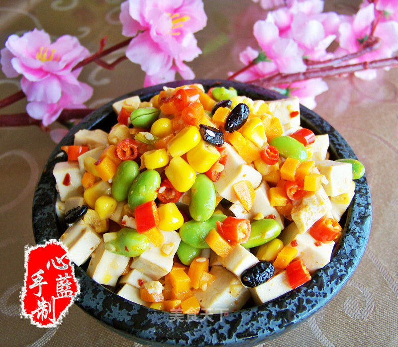

# 心蓝手制私房菜——剩女们的梦幻生活 上

## 📋 基本資訊 / Recipe Overview
- **料理名稱**：心蓝手制私房菜——剩女们的梦幻生活 上
- **原始標題**：心蓝手制私房菜【梦幻小炒】——剩女们的梦幻生活（上）
- **素食流派 / Diet**：全素 Vegan
- **料理分類 / Category**：家常蔬食 / 经典热菜
- **來源平台 / Source**：[美食天下 · 精華素食專區](https://home.meishichina.com/recipe-78768.html)

## 🌿 食材及佐料清單 / Ingredients
- 白干 400g (主料)
- 胡萝卜 50g (主料)
- 玉米粒 50g (主料)
- 毛豆 50g (主料)
- 蒜子 适量 (辅料)
- 小米辣 适量 (辅料)
- 油 5g (配料)
- 盐 4g (配料)
- 味素 2g (配料)
- 辣椒红油 2g (配料)

## 🍳 烹飪步驟 / Step-by-Step Cooking Steps
1. 白干切1cm见方小块，清洗干净待用
2. 胡萝卜切米，小米辣切圈，毛豆、玉米粒清洗干净，豆豉泡发，蒜子切米待用
3. 坐锅烧水，加少许盐，下白干过水待用
4. 坐锅烧水，加少许盐、油，下胡萝卜、毛豆、玉米粒过水待用
5. 坐锅起油，下豆豉、小米辣、蒜米炒香
6. 下胡萝卜、毛豆、玉米粒，加盐、味素，翻炒2分钟
7. 下白干，翻炒2分钟
8. 下辣椒红油，翻炒均匀，起锅即可

---
*食譜歸檔時間：2026-08-20 · 來源：美食天下 (home.meishichina.com)*