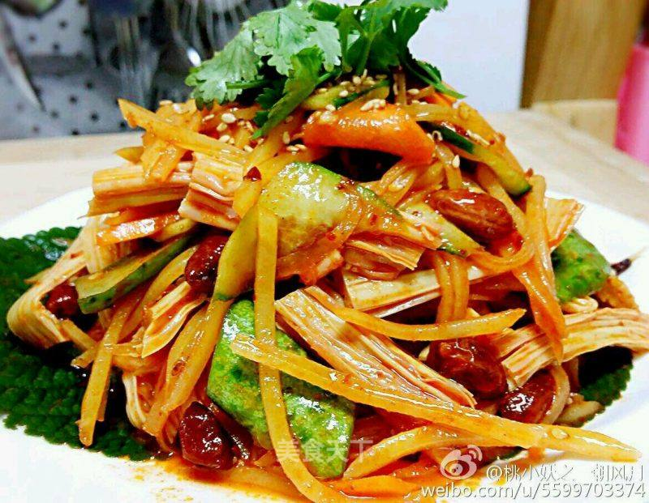

# 拌花菜

## 📋 基本資訊 / Recipe Overview
- **料理名稱**：拌花菜
- **原始標題**：拌花菜
- **素食流派 / Diet**：全素 Vegan
- **料理分類 / Category**：家常蔬食 / 经典热菜
- **來源平台 / Source**：[美食天下 · 精華素食專區](https://home.meishichina.com/recipe-232048.html)

## 🌿 食材及佐料清單 / Ingredients
- 黄瓜 适量 (主料)
- 腐竹 适量 (主料)
- 胡萝卜 适量 (主料)
- 花生米 适量 (主料)
- 土豆 适量 (主料)
- 香菜 适量 (辅料)
- 蒜 适量 (辅料)
- 韩式辣酱 适量 (辅料)
- 蒸鱼豉油 适量 (辅料)
- 盐 适量 (辅料)
- 糖 适量 (辅料)
- 白醋 适量 (辅料)
- 香油 适量 (辅料)
- 大喜大 适量 (辅料)
- 味精 适量 (辅料)

## 🍳 烹飪步驟 / Step-by-Step Cooking Steps
1. 准备食材，黄瓜、胡萝卜、土豆、腐竹、香菜、大蒜以及花生米(忘照进去了)
2. 花生米炒熟
3. 腐竹泡半个小时(不要泡太久时间，太软了就没有口感了，就要那个艮劲)
4. 土豆切丝，用开水焯两分钟，焯的时候放入少许白醋，以保证土豆丝脆脆的口感
5. 黄瓜、胡萝卜以及腐竹切斜段
6. 韩式辣酱2大勺、蒸鱼豉油1勺、香油1勺、糖3大勺、白醋1勺、大喜大、味精少许调好备用
7. 粗细辣椒面榨油，放少许芝麻
8. 把所有食材，调料6、辣椒油及蒜末放在一起，用手拌匀(韩式的咸菜都用手拌，能够入味)，最后撒少许芝麻和香菜即可

---
*食譜歸檔時間：2026-08-20 · 來源：美食天下 (home.meishichina.com)*