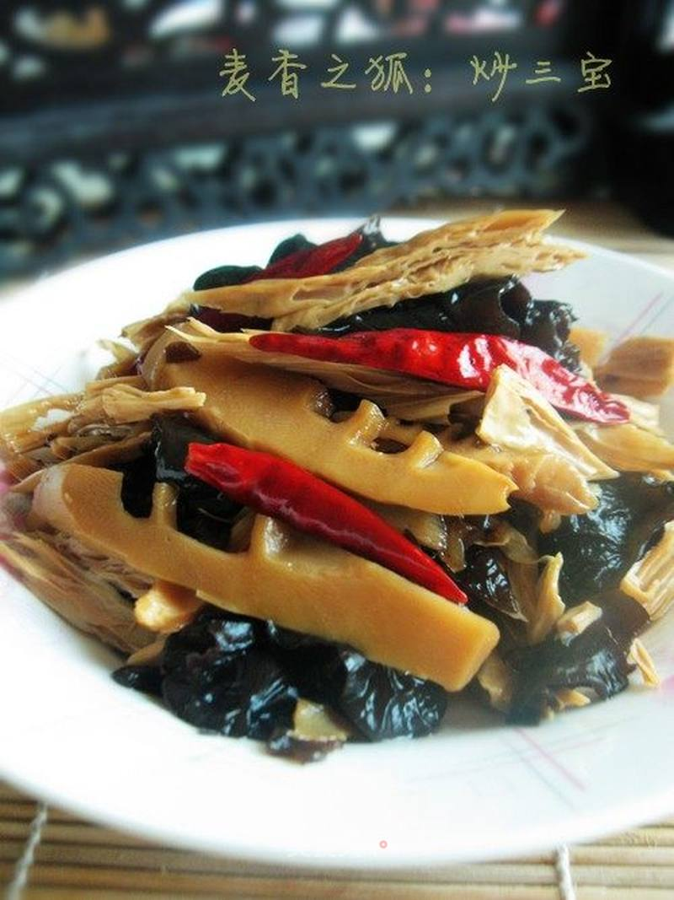

# 春笋木耳腐竹丝

## 📋 基本資訊 / Recipe Overview
- **料理名稱**：春笋木耳腐竹丝
- **原始標題**：春笋木耳腐竹丝
- **素食流派 / Diet**：全素 Vegan
- **料理分類 / Category**：家常蔬食 / 经典热菜
- **來源平台 / Source**：[美食天下 · 精華素食專區](https://home.meishichina.com/recipe-55258.html)

## 🌿 食材及佐料清單 / Ingredients
- 腐竹 适量 (主料)
- 春笋 适量 (主料)
- 木耳 适量 (主料)
- 盐 适量 (辅料)
- 油 适量 (辅料)
- 糖 适量 (辅料)
- 花椒 适量 (辅料)
- 老抽 适量 (辅料)
- 生抽 适量 (辅料)
- 姜丝 适量 (辅料)

## 🍳 烹飪步驟 / Step-by-Step Cooking Steps
1. 水发腐竹，切成丝，焯一下水。
2. 春笋切成片，焯一下水。
3. 水发木耳，焯一下水。
4. 锅里加入少许油，煸炒一下花椒粒和姜丝，然后捞出，炒一下笋丝。
5. 然后加入腐竹和木耳进行翻炒，锅里对一些开水，这时候加入老抽，生抽，盐和糖进校调味。
6. 小火炒10分钟即可，出锅前加入味精调味。

---
*食譜歸檔時間：2026-08-20 · 來源：美食天下 (home.meishichina.com)*