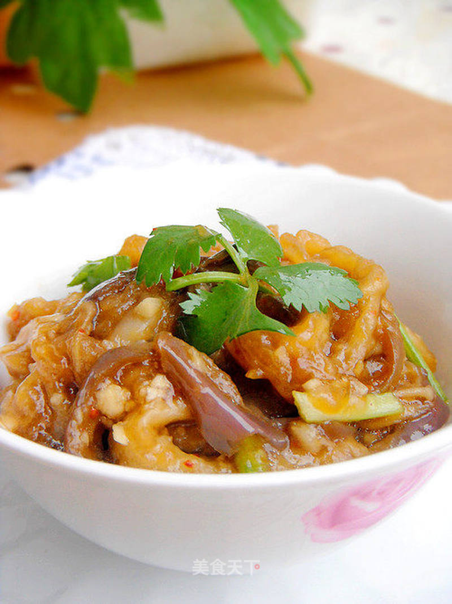

# 最美味的家常菜—辣味拌茄泥

## 📋 基本資訊 / Recipe Overview
- **料理名稱**：最美味的家常菜—辣味拌茄泥
- **原始標題**：最美味的家常菜—辣味拌茄泥
- **素食流派 / Diet**：全素 Vegan
- **料理分類 / Category**：面食主食
- **來源平台 / Source**：[美食天下 · 精華素食專區](https://home.meishichina.com/recipe-58428.html)

## 🌿 食材及佐料清單 / Ingredients
- 茄子 1个 (主料)
- 香菜 适量 (辅料)
- 大蒜 适量 (辅料)
- 生姜 适量 (辅料)
- 食盐 1茶勺 (配料)
- 蚝油 1/2汤勺 (配料)
- 生抽 1汤勺 (配料)
- 辣椒粉 适量 (配料)
- 香油 适量 (配料)
- 鸡精 适量 (配料)

## 🍳 烹飪步驟 / Step-by-Step Cooking Steps
1. 主要材料：茄子、香菜。
2. 茄子洗净，一分为二，再对半切开。
3. 放入蒸锅蒸熟。
4. 蒸熟的茄子稍微冷一下，撕成条。（如果烫说就稍等或者放入碗中用筷子挑成条）
5. 先调入1茶勺的食盐。（因为趁热调入盐会马上融化）
6. 调入1/2汤勺的蚝油。
7. 调入适量辣椒粉。（依据自己的口味添加）
8. 用筷子轻轻翻拌均匀。
9. 加入适量切成好的姜末和蒜茸。不（放在一起，不要分散着放）
10. 起锅烧热适量油至冒烟，浇在生姜末和蒜茸上。
11. 加入事先切好的香菜，调入几滴香油和鸡精。
12. 用筷子搅拌均匀，稍微浓绸，成茄泥即可。

---
*食譜歸檔時間：2026-08-20 · 來源：美食天下 (home.meishichina.com)*