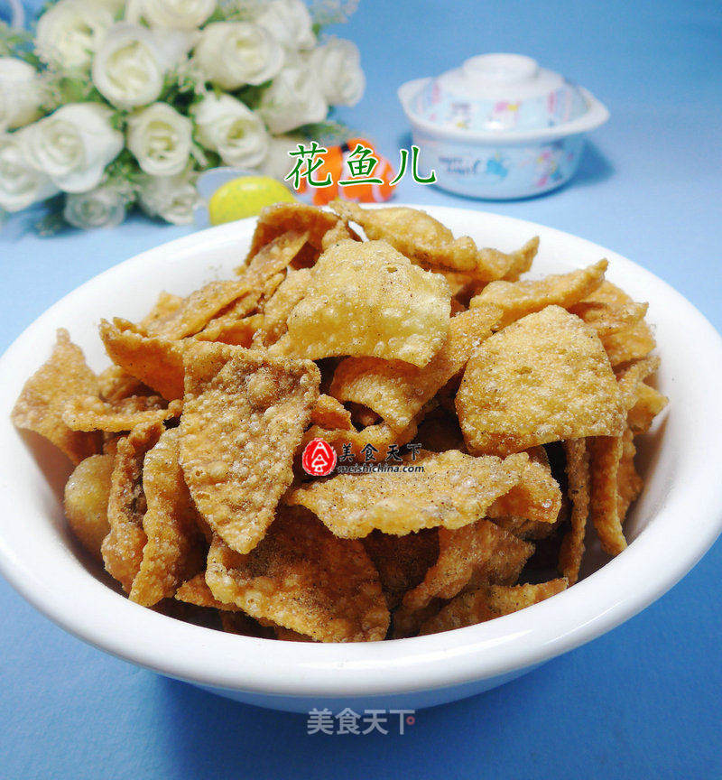

# 椒盐酥皮

## 📋 基本資訊 / Recipe Overview
- **料理名稱**：椒盐酥皮
- **原始標題**：椒盐酥皮
- **素食流派 / Diet**：全素 Vegan
- **料理分類 / Category**：面点小吃
- **來源平台 / Source**：[美食天下 · 精華素食專區](https://home.meishichina.com/recipe-229698.html)

## 🌿 食材及佐料清單 / Ingredients
- 饺子皮 195克 (主料)
- 椒盐 适量 (辅料)

## 🍳 烹飪步驟 / Step-by-Step Cooking Steps
1. 食材：饺子皮、椒盐
2. 将饺子皮放在案板上切开。
3. 接着，在锅中加入油烧热，下入切好的饺子皮炸至金黄色捞出。
4. 放入大碗中。
5. 然后，加适量的椒盐。
6. 上下抖匀，即成。

---
*食譜歸檔時間：2026-08-20 · 來源：美食天下 (home.meishichina.com)*